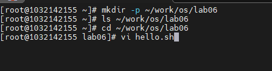
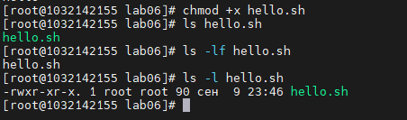
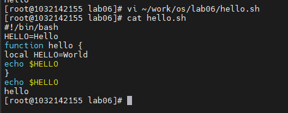

**РОССИЙСКИЙ УНИВЕРСИТЕТ ДРУЖБЫ НАРОДОВ**

**Факультет физико-математических и естественных наук**

**Кафедра прикладной информатики и теории вероятностей**

**ОТЧЕТ**

**по лабораторной работе № 9**

_дисциплина: Операционные системы_

Преподаватель: Велиева Татьяна Рефатовна

Студент: Муратов Кирилл Александрович

Группа: НПМбв-01-19

**МОСКВА**

2023 г.

**ЗАДАЧА:**

Знакомство с текстовым редактором vi

**ЦЕЛЬ:**

Познакомиться с операционной системой Linux. Получить практические навыки работы с редактором vi

**ИССЛЕДУЕМАЯ ОПЕРАЦИОННАЯ СИСТЕМА:**

1. CentOS

**ПО:**

1. Windows 10
2. Диспетчер Hyper-v от Microsoft
3. MobaXTern

**ТЕРМИНЫ:**

**SSH** (**secure shell** ) - сетевой протокол прикладного уровня, позволяющий производить удалённое управление операционной системой и туннелирование TCP-соединений.

**OS\ОС** – операционная система

**Linux** – семейство UNIX-подобных ОС на базе ядра Linux

**Начало работы**

Создаю директорию lab06 командой: mkdir -p ~/work/os/lab06
Перехожу в директорию lab06 командой: cd ~/work/os/lab06
Создаю файл hello.sh командой: vi hello.sh

Нажимаю i для активации режима вставки.
Ввожу bash
Нажимаю Esc для перехода в командный режим после завершения ввода текста.
Нажимаю : для перехода в режим последней строки
Ввожу wq и нажимаю Enter тем самым сохраняю данные.
Командой cat hello.sh проверяю содержимое файла.

Добавляю права на выполнение скрипта командой chmod +x hello.sh
И командой ls -l hello.sh проверяю права

Открываю файл hello.sh в редакторе vi командой: vi hello.sh
Устанавливаю курсор в конец слова HELL с помощью стрелок.
Перехожу в режим вставки и замените на HELLO. Нажимаю на Esc для возврата в командный режим.
Устанавливаю курсор на четвертую строку и сотрите слово LOCAL
Перехожу в режим вставки и ввожу следующий текст: local, далее нажимаю Esc для возврата в командный режим.
Устанавливаю курсор на последную строчку файла. Вставляю после неё строку, содержащую следующий текст: echo $HELLO.
Нажимаю Esc для перехода в командный режим. Удаляю последнюю строку.
Ввожу команду отмены изменений и нажимаю на u для отмены последней команды. Нажимаю на символ : для перехода в режим последней строки. Записываю произведённые (:wq) изменения и выхожу из vi.
Вывожу изменения на терминал командой: cat hello.sh

**Вывод:**
Были получены практические навыки владения текстовым редактором vi.
Были усвоены навыки редактирования, поиска и позиционирования по файлу.

**Контрольные вопросы:**
**1. Дайте краткую характеристику режимам работы редактора vi.**  
Есть 3 режима работа редактора: командный режим (command mode), режим ввода (insert mode) и режим последней строки (last line mode). При запуске редактора vi запускается в командном режиме. В этом режиме можно давать команды для редактирования файлов или перейти в другой режим. Основной ввод и редактирование текста осуществляется в режиме ввода. Режим последней строки — это специальный режим, в котором редактору даются сложные команды  
**2. Как выйти из редактора, не сохраняя произведённые изменения?**  
Переход в режим поледний строки. Затем символ :, а потом нажать клавишу q или q!     
**3. Назовите и дайте краткую характеристику командам позиционирования.**  
0 - переход в начало строки. $ переход в конец строки. G - переход в конец файла. nG переход на строчку n     
**4. Что для редактора vi является словом?**  
Буквы раздленные пробелом     
**5. Каким образом из любого места редактируемого файла перейти в начало (конец) файла?**  
0G для переход в начало файла, а G в конец файла.     
**6. Назовите и дайте краткую характеристику основным группам команд редактирования.**  
a - вставка текста после курсова. A - вставка текста в конец строки. i - вставка текста перед курсором. ni вставка текста n раз. I вставка текста в начало строки. o вставка строки под курсором. O вставка строки над курсором. x удалить один символ в буфер. dw удалить одно слово в буфер. d$ удалить в буфер текст от курсора до конца строки d0 удалить в буфер текст от начала строки до позиции курсора. dd удалить в буфер одну строку. ndd удалить в буфер и строк. u отменить последнее изменение. . повторить последнее изменение. Y скопировать строку в буфер. nY скопировать n строк в буфер. yw скопировать слово в буфер. p вставка текста из буфера после курсора. P вставить текста из буфера перед курсором. cw заменить слово ncw заменить n слов. c$ заменить текст от курсора до конца строки. r заменить слово. R заменить тест. / поиск вперед по тексту указанной строки. ? поиск назад по тексту указанной строки.    
**7. Необходимо заполнить строку символами $. Каковы ваши действия?**  
Перейти в режим вставки и экранировать символом \ бек-слешем.     
**8. Как отменить некорректное действие, связанное с процессом редактирования?**  
Ctrl + u     
**9. Назовите и дайте характеристику основным группам команд режима последней строки.**  
a - вставка текста после курсова. A - вставка текста в конец строки. i - вставка текста перед курсором. ni вставка текста n раз. I вставка текста в начало строки. o вставка строки под курсором. O вставка строки над курсором. x удалить один символ в буфер. dw удалить одно слово в буфер. d$ удалить в буфер текст от курсора до конца строки d0 удалить в буфер текст от начала строки до позиции курсора. dd удалить в буфер одну строку. ndd удалить в буфер и строк. u отменить последнее изменение. . повторить последнее изменение. Y скопировать строку в буфер. nY скопировать n строк в буфер. yw скопировать слово в буфер. p вставка текста из буфера после курсора. P вставить текста из буфера перед курсором. cw заменить слово ncw заменить n слов. c$ заменить текст от курсора до конца строки. r заменить слово. R заменить тест. / поиск вперед по тексту указанной строки. ? поиск назад по тексту указанной строки. :W записывает изменения и не выходит из редактора. :W<filename> записывает измененный текст в новый файл с именем <filename>. :W!<filename> записывает измененный текст в новый файл с именем <filename>. :Wq записывает изменения в файл и выходит из редактора. :q выйти из редактора :q! выйти из редактора без записи. :e! отменить все изменения с момента последний записи.  
**10. Как определить, не перемещая курсора, позицию, в которой заканчивается строка?**  
$ переход в конец строки.     
**11. Выполните анализ опций редактора vi (сколько их, как узнать их назначение ит.д.).**  
man vi. vi <filename> - Список имен файлов. Первым будет текущий файл, который будет прочитан в буфер. vi -t <tag> Файл для редактирования и начальная позиция курсора зависят от «тега», своего рода метки перехода. vi -q <errorfile> открытие файла в отладочном режиме.     
**12. Как определить режим работы редактора vi?**  
В нижнем левом углу отбражается текущий режим работы.     
**13. Постройте граф взаимосвязи режимов работы редактора vi.**  
     