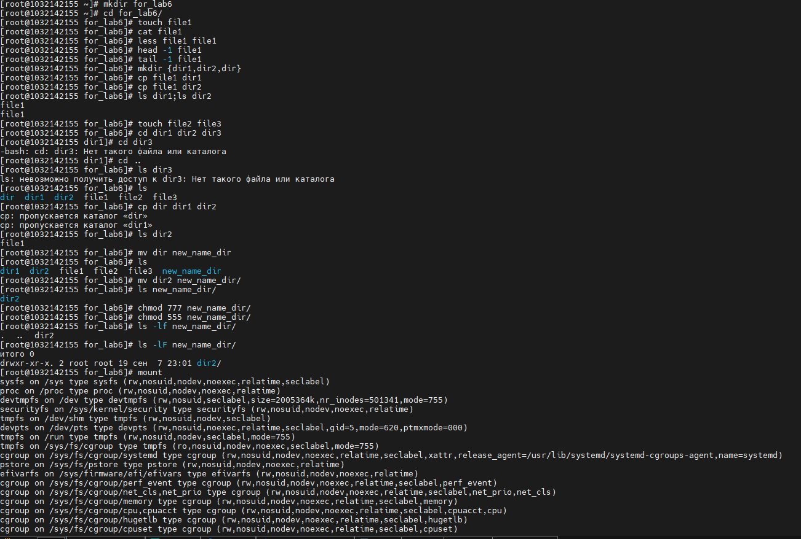
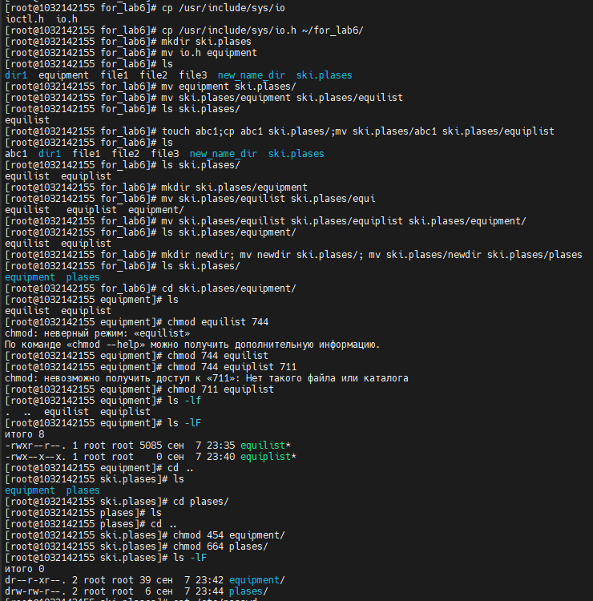
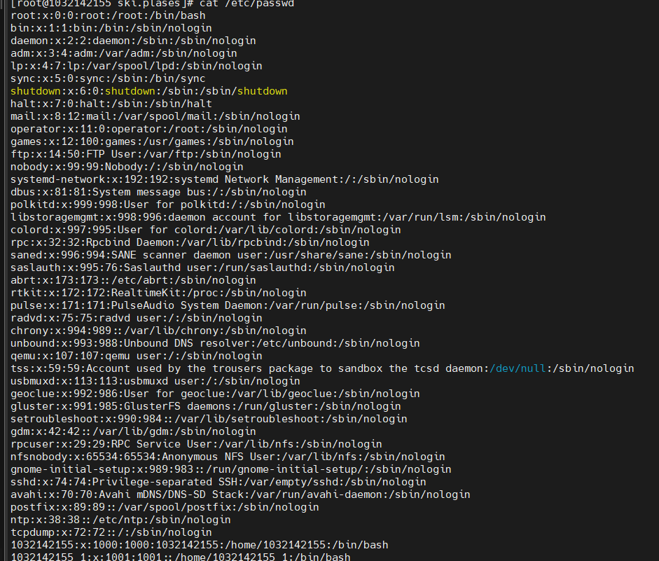

**РОССИЙСКИЙ УНИВЕРСИТЕТ ДРУЖБЫ НАРОДОВ**

**Факультет физико-математических и естественных наук**

**Кафедра прикладной информатики и теории вероятностей**

**ОТЧЕТ**

**по лабораторной работе № 6**

_дисциплина: Операционные системы_

Преподаватель: Велиева Татьяна Рефатовна

Студент: Муратов Кирилл Александрович

Группа: НПМбв-01-19

**МОСКВА**

2023 г.

**ЗАДАЧА:**

Анализ файловой системы Linux. Команды для работы с файлами и каталогами

**ЦЕЛЬ:**

Ознакомление с файловой системой Linux, её структурой, именами и содержанием каталогов. Приобретение практических навыков по применению команд для работы с файлами и каталогами, по управлению процессами (и работами), по проверке использования диска и обслуживанию файловой системы.

**ИССЛЕДУЕМАЯ ОПЕРАЦИОННАЯ СИСТЕМА:**

1. CentOS

**ПО:**

1. Windows 10
2. Диспетчер Hyper-v от Microsoft
3. MobaXTern

**ТЕРМИНЫ:**

**SSH** (**secure shell** ) - сетевой протокол прикладного уровня, позволяющий производить удалённое управление операционной системой и туннелирование TCP-соединений.

**OS\ОС** – операционная система

**Linux** – семейство UNIX-подобных ОС на базе ядра Linux

**Начало работы**

В домашней директории создаю новую директорию, где буду выполнять ход лаб работы.
Перехожу в директорию for_lab6
Создаю новый файл под названием file1. Команда: touch file1
Смотрю содержимое файла с помощью команды cat file1, less file1, head -1 file (вывожу только 1 строчку файла), tail -1 file1 (вывожу последнюю строчку файла)
Создаю 3 новые директории dir1,dir2,dir. Команда: mkdir {dir1,dir2,dir}
Копирую файл file1 в директорию dir1. Команда: cp file1 dir1
Копирую файл file1 в директорию dir2. Команда: cp file1 dir2
Проверяю, что копирование прошло успешно - командой: ls dir1; ls dir2
Командой touch создаю еще 2 файла file2 file3: touch file2 file3
Копирую директории dir dir1 в директорию dir2 командой: cp dir dir1 dir2
Проверяю содержимое директории dir2 командой:ls dir2
Для переименования директории dir в new_name_dir - использую команду:mv dir new_name_dir.
Командой ls проверяю, что переименование прошло успешно.
Командой chmod буду менять прова доступа для директории new_name_dir. chmod 777 new_nane_dir/ - результат - пользователь,группа и все остальные (rwx) получают полный доступ
Командой chmod буду менять прова доступа для директории new_name_dir. chmod 555 new_nane_dir/ - результат - пользователь,группа и все остальные (r--) получают только доступ на чтение
Командой ls -lF new_name_dir/ проверяю уровень доступа.
Командой mount - выводит список монированных файловых систем (диск, переф. и т.д)
Так же можно посмотреть в виде файла командой:cat /etc/fstab

Копирую файл io.h из директории /usr/include/sys в домашний каталог в директорию for_lab6 командой: cp /usr/include/sys/io.h ~/for_lab6/
Создаю директорию ski.plases командой: mkdir ski.plases
Переименновываю io.h в equipment командой: mv io.h equipment
Проверяю выполнение команды ls
Перемещаю equipment в директорию ski.plases командой: mv equipment ski.plases/
Переименовывая equipment в equilist командой: mv ski.plases/equipment ski.plases/equilist
Проверяю выполнение переименования командой: ls ski.plases/
Далее. Создаю файл abc1. Копирую его в ski.plases/ и переименовываю его в equiplist. touch abc1;cp abc1 ski.plases/;mv ski.plases/abc1 ski.plases/equiplist
Проверяю выполненные действия командой ls ski.plases/
Создаю новыую директорию equipment командой: mkdir ski.plases/equipment
Копирую equilist и equiplist в директорию equipment. mv ski.plases/equilist ski.plases/equiplist ski.plases/equipment/
Проверяю выполненные действия командой ls ski.plases/equipment/
Создаю новыю директорию newdir. Перемещаю её ski.plases/ и переименовываю её в plases mkdir newdir; mv newdir ski.plases/; mv ski.plases/newdir ski.plases/plases
Проверяю выполненные действия командой ls ski.plases/
Выдаю права файлу equilist пользователь - полный доступ, а группе и всем остальным только чтение. chmod 744 equilist
Выдаю права файлу equiplist пользователь - полный доступ, а группе и всем остальным только выполнение. chmod 711 equiplist
Дирктории equipment выдаю права 454, что соответствует пользователь и все остальные - только чтение, а группе чтение и выполнение chmod 454 equipment/
Дирктории plases выдаю права 664, что соответствует пользователь и группы - чтение и запись, а все остальные только чтение chmod 664 plases/
Проверяю выданные прова командой ls -lF

Для просмотра документа выбираю встроенный обозреватель cat и передаю в него путь к файлу.

**Вывод**

Ознакомление с файловой системой Linux, её структурой, именами и содержанием каталогов. Приобретение практических навыков по применению команд для работы с файлами и каталогами

**Контрольные вопросы**

**1. Дайте характеристику каждой файловой системе, существующей на жёстком диске компьютера, на котором вы выполняли лабораторную работу.**
**2. Приведите общую структуру файловой системы и дайте характеристику каждой директории первого уровня этой структуры.**
**3. Какая операция должна быть выполнена, чтобы содержимое некоторой файловой системы было доступно операционной системе?**
**4. Назовите основные причины нарушения целостности файловой системы. Как устранить повреждения файловой системы?**
**5. Как создаётся файловая система?**
**6. Дайте характеристику командам, которые позволяют просмотреть текстовые файлы.**
cat <name_file> для не больших файлов
less <name_file> для больших файлов (> 1MБ) она позволяет осуществлять постраничный просмотр файлов длина страницы соответствует размеру экрана.
head [-n] имя-файла, n - количество строк свеху.
tail [-n] имя-файла, n - количество строк снизу.
**7. Приведите основные возможности команды cp в Linux.**
Команда cp копирует файл или каталог, указанный в параметре Исходный_файл или Исходный_каталог, в файл или каталог, заданный в параметре Целевой_файл или Целевой_каталог.
Если Целевой_файл существует, то его содержимое заменяется без предупреждения. При копировании нескольких Исходных_файлов должен быть указан целевой каталог.
**8. Назовите и дайте характеристику командам перемещения и переименования файлов и каталогов.**
Команда mv отвечает за перемещения и переименования.mv <опции> <исходные_файлы> <куда>
**9. Что такое права доступа? Как они могут быть изменены?**
Это способ ограничения к данным. От закрытии прав до долного доступа к ним.
chmod - встроенная функция, которая отвечает за настройку прав.