**РОССИЙСКИЙ УНИВЕРСИТЕТ ДРУЖБЫ НАРОДОВ**

**Факультет физико-математических и естественных наук**

**Кафедра прикладной информатики и теории вероятностей**

**ОТЧЕТ**

**по лабораторной работе № 8**

_дисциплина: Операционные системы_

Преподаватель: Велиева Татьяна Рефатовна

Студент: Муратов Кирилл Александрович

Группа: НПМбв-01-19

**МОСКВА**

2023 г.

**ЗАДАЧА:**

Поиск файлов. Перенаправление ввода-вывода. Просмотр запущенных процессов

**ЦЕЛЬ:**

Ознакомление с инструментами поиска файлов и фильтрации текстовых данных. Приобретение практических навыков

**ИССЛЕДУЕМАЯ ОПЕРАЦИОННАЯ СИСТЕМА:**

1. CentOS

**ПО:**

1. Windows 10
2. Диспетчер Hyper-v от Microsoft
3. MobaXTern

**ТЕРМИНЫ:**

**SSH** (**secure shell** ) - сетевой протокол прикладного уровня, позволяющий производить удалённое управление операционной системой и туннелирование TCP-соединений.

**OS\ОС** – операционная система

**Linux** – семейство UNIX-подобных ОС на базе ядра Linux

**Начало работы**

Устанавливаю утилиту mc командой dnf install mc -y
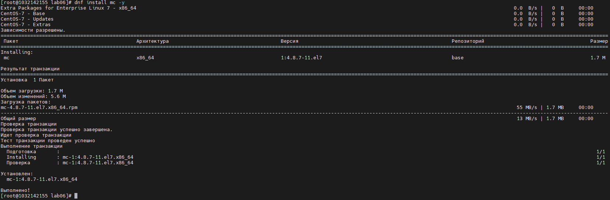

Просматриваю описание к утилите mc командой man mc
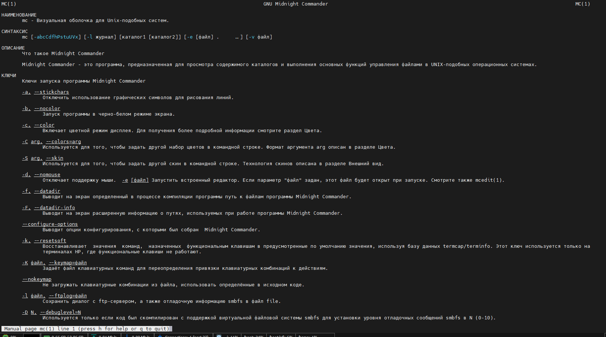

Запускаю утилиту mc из терминала командой mc
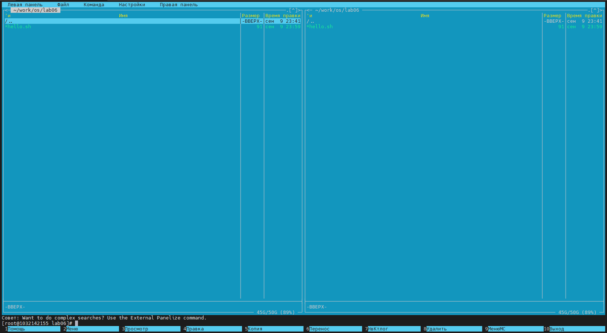

С помощью управляющих клавиш перемещаюсь в корневой каталог
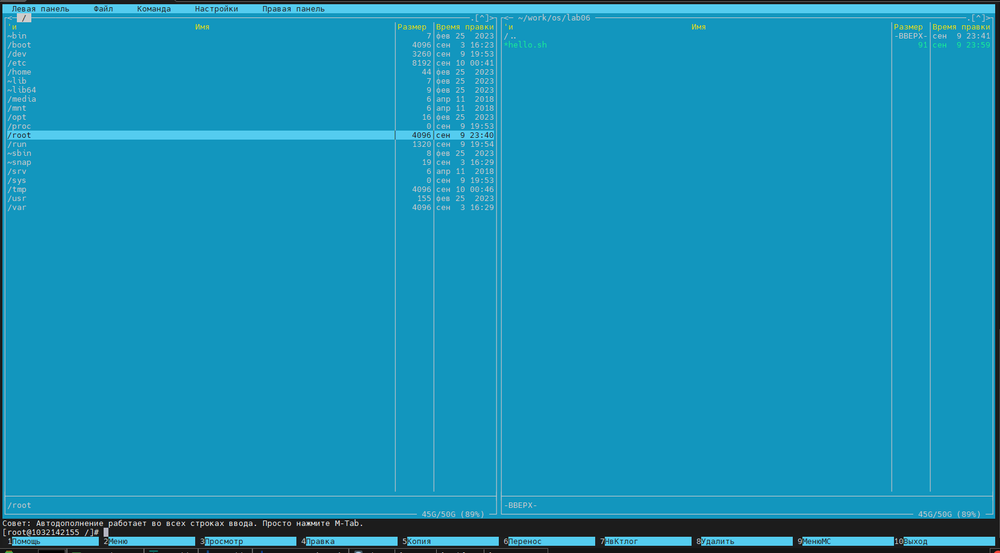

В левой панели просматриваю права к директории /root
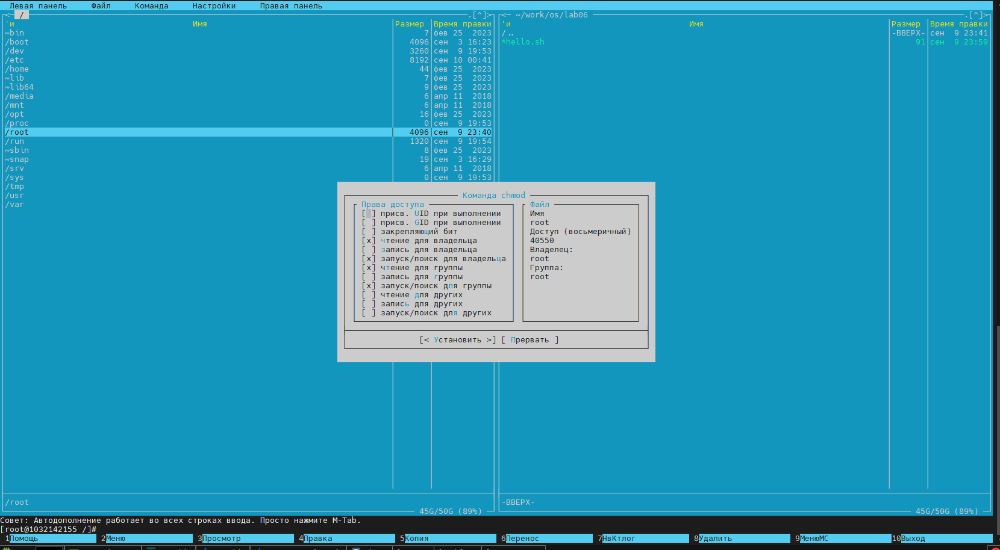

В домашней директории просматриваю публичный ключ, который был использован для лаб раб 2
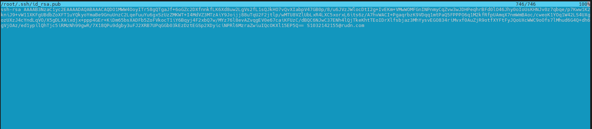

В домашней директории редактирую публичный ключ, который был использован для лаб раб 2. Добавляю в начало файл "This is my public key". И закрываю файл без сохранения.
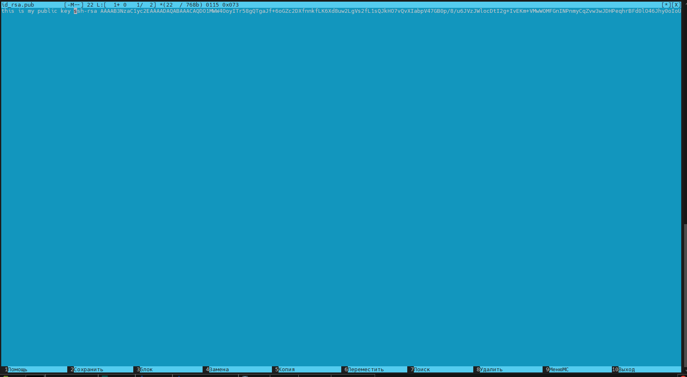

Нажатием f7 создаю новую директорию и называю её NewDir
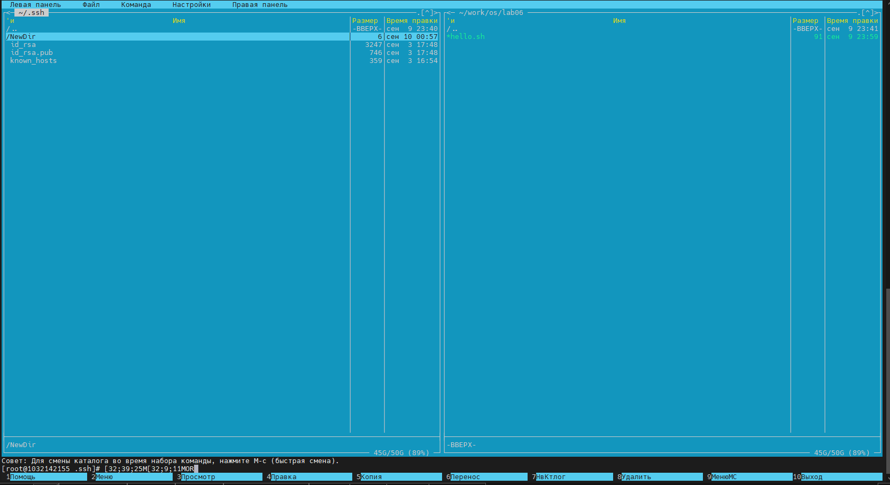

Нажатием f5 копирую файл в директорию, которую создал на предыдущим шаге
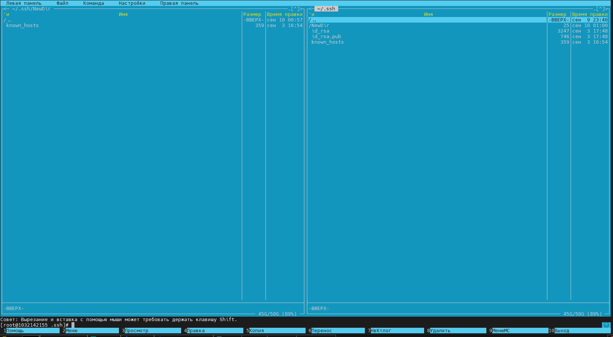

Перехожу в команду и выпираю поиск файла
Условие поиска:
Искать на всем диске
Рекурсивный поиск
Пропускать скрыте
Поиск по содержимому => Main
Для имени файла использую регулярное выражение: .{1,}\.(c|cpp)$ 
Читается так: имя может содержать любой символ кроме новой строчки. экранирую ., чтобы не учитывалось как любой символ кроме новой строчки. и групперую расширение файла как или .c или .cpp
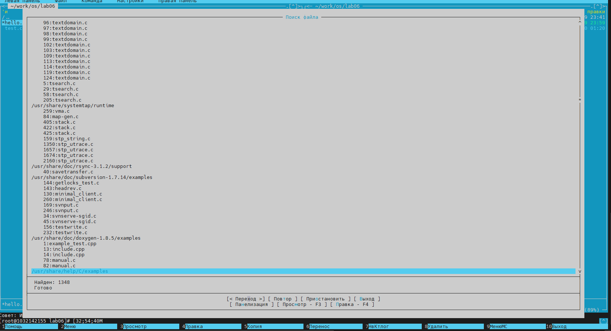

В терминале создаю файл text.txt командой:touch text.txt и открываю его в утилите mc
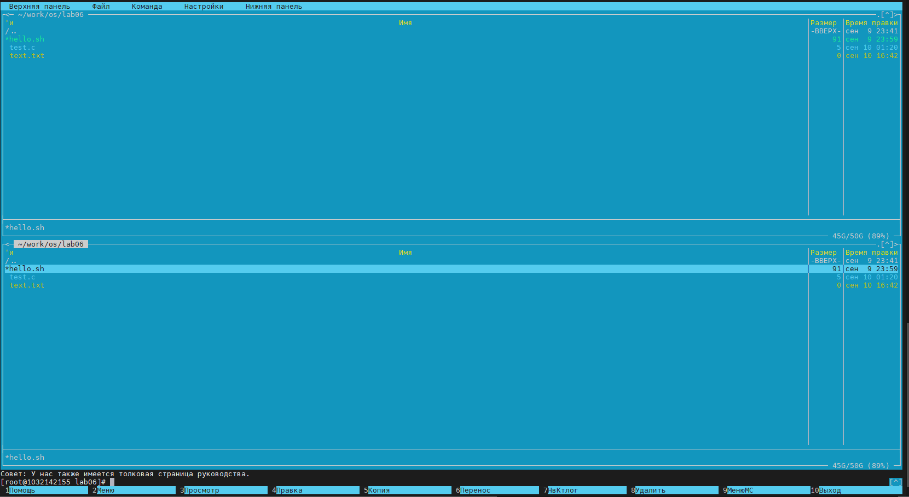

Нажатием на f4 открываю файл для правки и вставляю туда текст, который я нашел в интернете
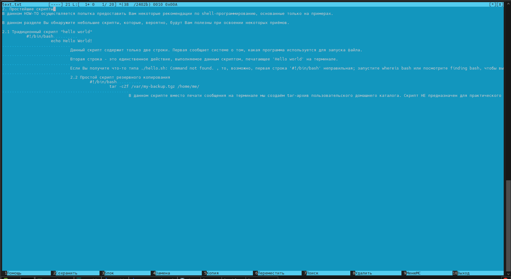

Сочетанием клавиш ctrl+y удаляю строчку
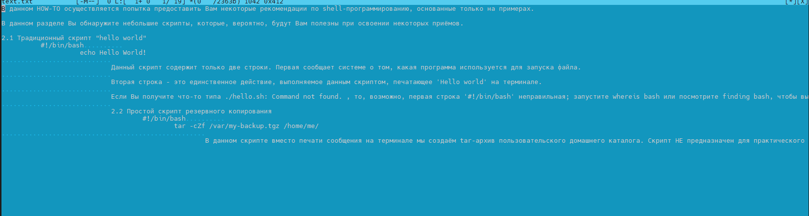

Выделяю фрагмет сочетением клавиш shift+home текст и скопирую на новую строчку нажатием на f5 
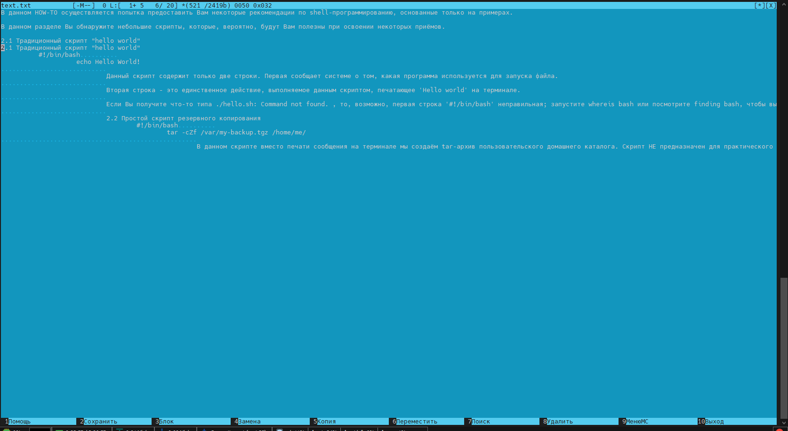

Сохраняю файл нажатием на f10
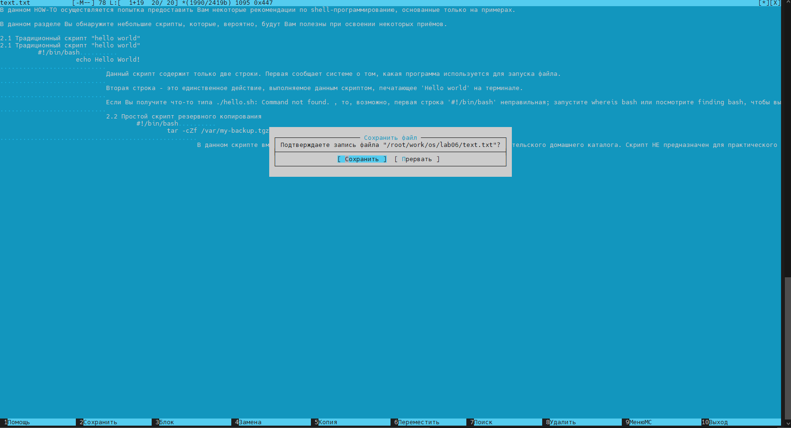

Отменяю последние действие нажатием на ctrl+u
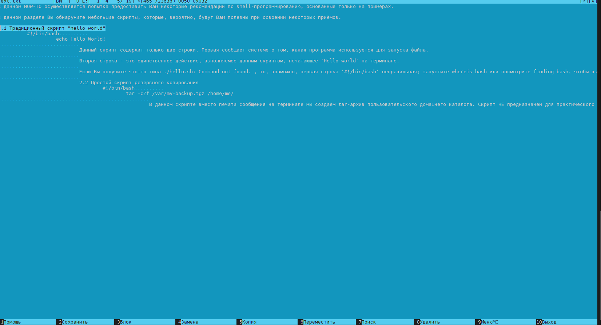

Перехожу в конец файла нажатием на page down и добавляю текст
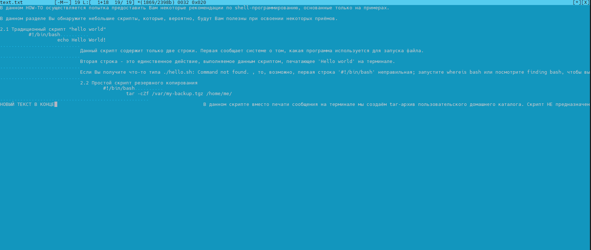

Перехожу в начало файла нажатием на page up и добавляю текст. Нажатием на f10 выхожу из редактора.
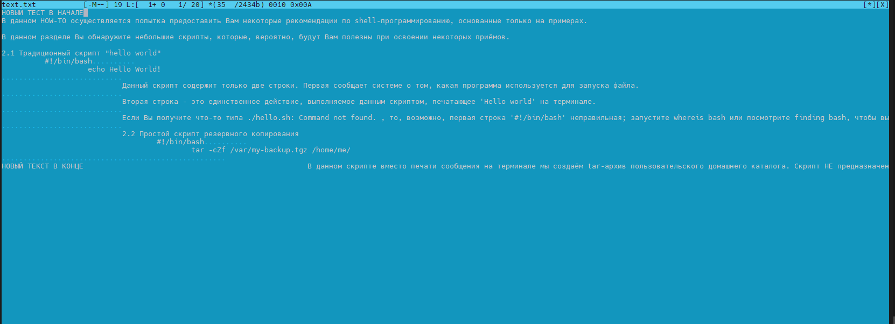

**Вывод:**

**Контрольные вопросы:**

**1. Какие режимы работы есть в mc. Охарактеризуйте их.**
Режим информация - предоставляет основную информацию о файле
Режим дерево - предоставляет информацию о директориях ввиде дерева.
**2. Какие операции с файлами можно выполнить как с помощью команд shell, так и с помощью меню (комбинаций клавиш) mc? Приведите несколько примеров.**
Жёсткая ссылка ( Ctrl-x l ) — позволяет создать жёсткую ссылку к текущему (или выделенному) файлу.Жёсткая ссылка проявляется как реальный файл. После её создания невозможно определить, где сам файл, а где ссылка на него. Если удалить один из этих файлов, то другой останется целым.
Символическая ссылка ( Ctrl-x s ) — позволяет создать символическую ссылку к текущему (или выделенному) файлу. Символическая ссылка — ссылка (указатель) на имя файла-оригинала.
Владелец/группа ( Ctrl-x o ) — позволяет задать (изменить) владельца и имя группы для одного или нескольких файлов или каталогов.
Переименование ( F6 ) — позволяет переименовать (или переместить) один или несколько файлов или каталогов.
Создание каталога ( F7 ) — позволяет создать каталог.
Удалить ( F8 ) — позволяет удалить один или несколько файлов или каталогов.
Выход ( F10 ) — завершает работу mc.
**3. Опишите структура меню левой (или правой) панели mc, дайте характеристику командам.**
Дерево каталогов — отображает структуру каталогов системы.
Поиск файла — выполняет поиск файлов по заданным параметрам.
Переставить панели — меняет местами левую и правую панели.
Сравнить каталоги ( Ctrl-x d ) — сравнивает содержимое двух каталогов.
Размеры каталогов — отображает размер и время изменения каталога (по умолчанию в mc размер каталога корректно не отображается).
История командной строки — выводит на экран список ранее выполненных в оболочке команд.
Каталоги быстрого доступа ( Ctrl-\ ) — пр вызове выполняется быстрая смена текущего каталога на один из заданного списка.
Восстановление файлов — позволяет восстановить файлы на файловых системах ext2 и ext3.
Редактировать файл расширений — позволяет задать с помощью определённого синтаксиса действия при запуске файлов с определённым расширением (например, какое программного обеспечение запускать для открытия или редактирования файлов с расширением doc или docx).
Редактировать файл меню — позволяет отредактировать контекстное меню пользователя, вызываемое по клавише F2 .
Редактировать файл расцветки имён — позволяет подобрать оптимальную для пользователя расцветку имён файлов в зависимости от их типа.
**4. Опишите структура меню Файл mc, дайте характеристику командам.**
Просмотр ( F3 ) — позволяет посмотреть содержимое текущего (или выделенного) файла без возможности редактирования.
Просмотр вывода команды ( М + ! ) — функция запроса команды с параметрами (аргумент к текущему выбранному файлу).
Правка ( F4 ) — открывает текущий (или выделенный) файл для его редактирования.
Копирование ( F5 ) — осуществляет копирование одного или нескольких файлов или каталогов в указанное пользователем во всплывающем окне место.
Права доступа ( Ctrl-x c ) — позволяет указать (изменить) права доступа к одному или нескольким файлам или каталогам
**5. Опишите структура меню Команда mc, дайте характеристику командам.**
**6. Опишите структура меню Настройки mc, дайте характеристику командам.**
Конфигурация — позволяет скорректировать настройки работы с панелями.
Внешний вид и Настройки панелей — определяет элементы (строка меню, командная строка, подсказки и прочее), отображаемые при вызове mc, а также геометрию расположения панелей и цветовыделение.
Биты символов — задаёт формат обработки информации локальным терминалом.
Подтверждение — позволяет установить или убрать вывод окна с запросом подтверждения действий при операциях удаления и перезаписи файлов, а также при выходе из программы.
Распознание клавиш — диалоговое окно используется для тестирования функциональных клавиш, клавиш управления курсором и прочее.
Виртуальные ФС настройки виртуальной файловой системы: тайм-аут, парольи прочее.
**7. Назовите и дайте характеристику встроенным командам mc.**
Ctrl-y удалить строку
Ctrl-u отмена последней операции
Ins вставка/замена
F7 поиск (можно использовать регулярные выражения)
shift+F7 повтор последней операции поиска
F4 замена
F3 первое нажатие — начало выделения, второе — окончание
выделения
F5 копировать выделенный фрагмент
F6 переместить выделенный фрагмент
F8 удалить выделенный фрагмент
F2 записать изменения в файл
F10 выйти из редактора
**8. Назовите и дайте характеристику командам встроенного редактора mc.**
Встроенный в mc редактор вызывается с помощью функциональной клавиши F4 . В нём удобно использовать различные комбинации клавиш при редактировании содержимого (как правило текстового) файла
**9. Дайте характеристику средствам mc, которые позволяют создавать меню, определяемые пользователем.**
**10. Дайте характеристику средствам mc, которые позволяют выполнять действия, определяемые пользователем, над текущим файлом.**