**РОССИЙСКИЙ УНИВЕРСИТЕТ ДРУЖБЫ НАРОДОВ**

**Факультет физико-математических и естественных наук**

**Кафедра прикладной информатики и теории вероятностей**

**ОТЧЕТ**

**по лабораторной работе № 7**

_дисциплина: Операционные системы_

Преподаватель: Велиева Татьяна Рефатовна

Студент: Муратов Кирилл Александрович

Группа: НПМбв-01-19

**МОСКВА**

2023 г.

**ЗАДАЧА:**

Поиск файлов. Перенаправление ввода-вывода. Просмотр запущенных процессов

**ЦЕЛЬ:**

Ознакомление с инструментами поиска файлов и фильтрации текстовых данных. Приобретение практических навыков

**ИССЛЕДУЕМАЯ ОПЕРАЦИОННАЯ СИСТЕМА:**

1. CentOS

**ПО:**

1. Windows 10
2. Диспетчер Hyper-v от Microsoft
3. MobaXTern

**ТЕРМИНЫ:**

**SSH** (**secure shell** ) - сетевой протокол прикладного уровня, позволяющий производить удалённое управление операционной системой и туннелирование TCP-соединений.

**OS\ОС** – операционная система

**Linux** – семейство UNIX-подобных ОС на базе ядра Linux

**Начало работы**

Вхожу в систему под учетной записью root
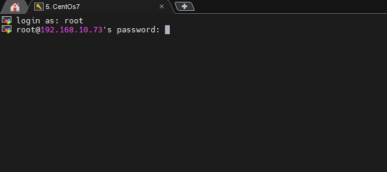

Командой find /etc -type f > file.txt записываю найденые файлы в директории etc и открываю содержимое файла file.txt обозревателем nano
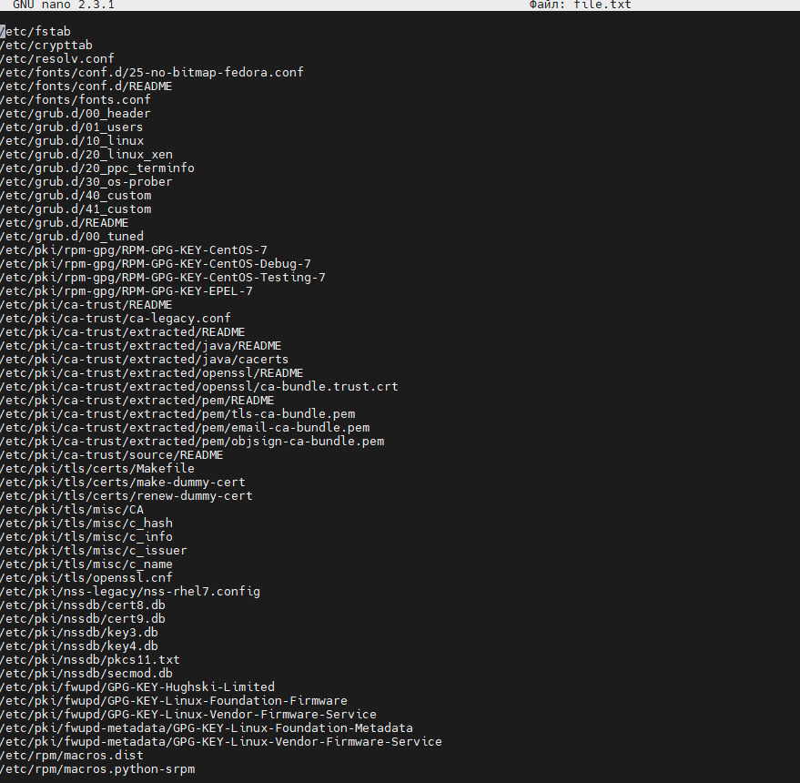

Командой find ~ -type f >> file.txt записываю в конец файла file.txt - файлы, которые содержаться в домашнем каталоге.
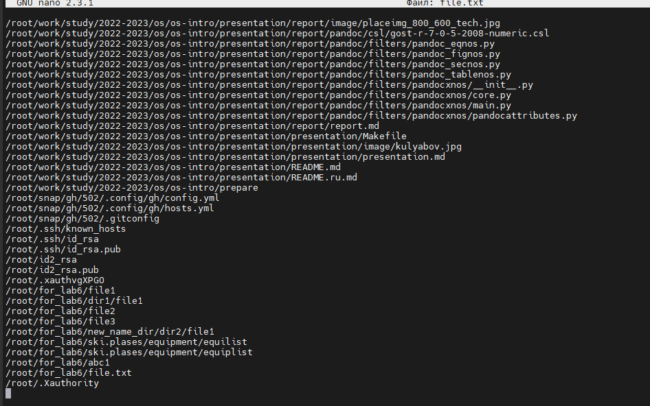

Выполняю поиск в файле file.txt на содержимое .conf командой grep .conf file.txt > conf.txt и вывожу содержимое нового файла командой nano conf.txt
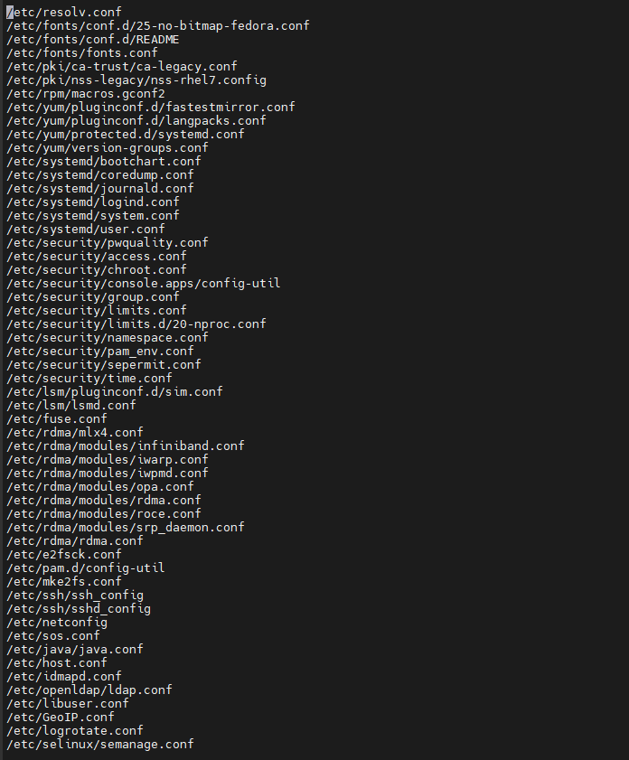

Для поиска в домашнем каталоге файлов имя которых начинается с "c" использую команду: find ~ -name "c*" -type f -print
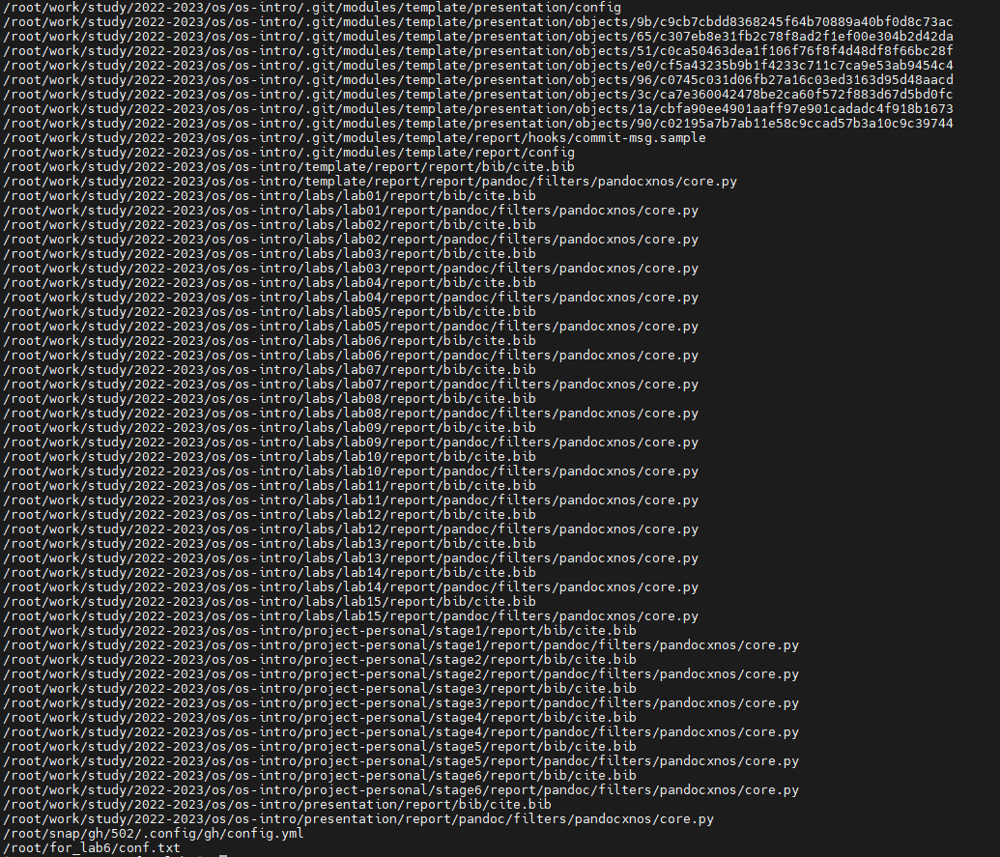

Если требуется найти файл, который начиается на "с" и имеет расширение ".txt" можно использовать команду find ~ -name "c*" -name "*.txt" -type f -print
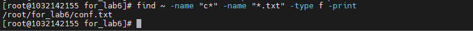

Для поиска файлов в директории /etc/, имя файла которое начинается на h использую команду:find /etc/ -name "h*" -type f -print
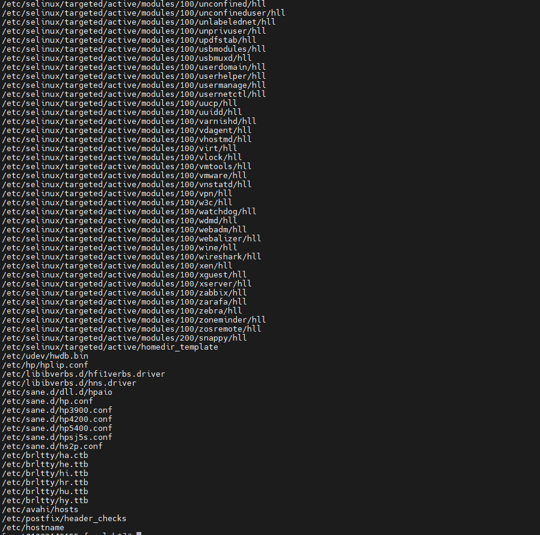

В директории /var/log ведётся поиск файлов, имя которых заканчивается на "log" и записываю результат в файл "logfile". Команда: find /var/log -name "*.log" > logfile &
После удаляю файл командой: rm -f logfile
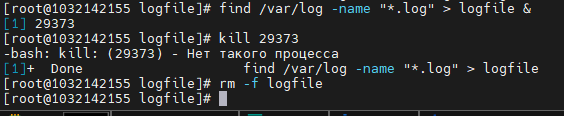

Запускаю текстовый рдактор в фон режиме командой: gedit &. В консоль выводится номер процесса. И командой: kill закрываю процесс.
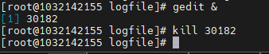

Получаю справочнию информацию про функцию kill командой: man kill
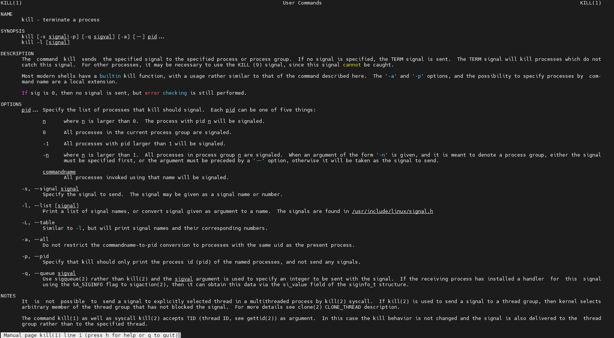

Получаю справочную информацию о df командой: man df
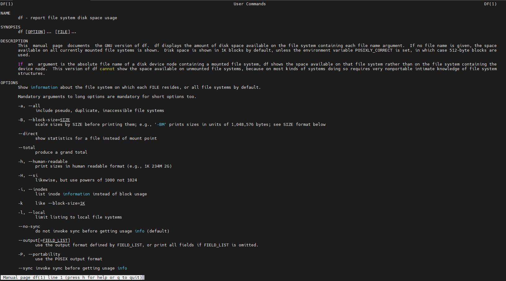

Получаю справочную информацию о du командой: man du
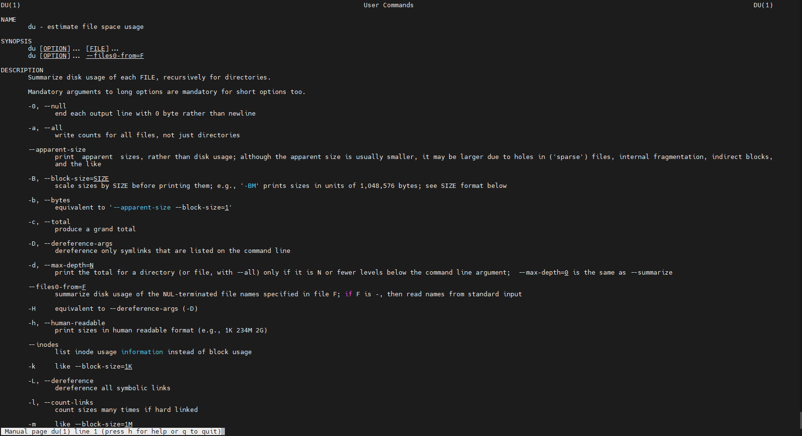

Получаю справочную информацию о find командой: man find
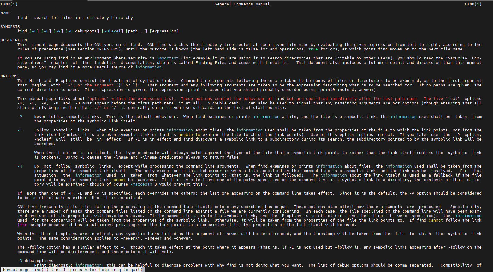

Для поиска все директорий в домашнем каталоге использую команду: find ~ -type d -print
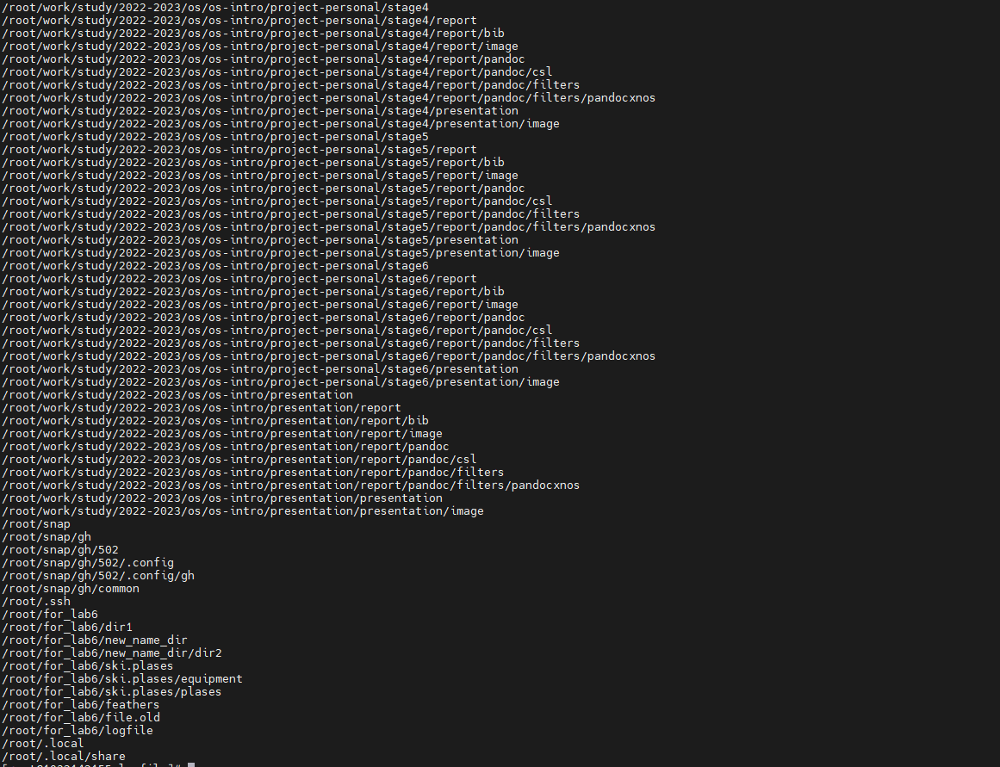

**Вывод:**
Были получены проктические навыки в поиске и фильтрации файлов и директорий в файловой системе Linux, а так же поиска содержимаго файлов.
Так же были получены практические навыки в создании и управлении потоками.

**Контрольные вопросы:**

**1. Какие потоки ввода вывода вы знаете?**
stdin => стандартный поток ввода (по умолчанию: клавиатура), файловый дескриптор 0
stdout => стандартный поток вывода (по умолчанию: консоль), файловый дескриптор 1;
stderr => стандартный поток вывод сообщений об ошибках (по умолчанию:консоль), файловый дескриптор 2.
**2. Объясните разницу между операцией > и >>.**
\> предназначена для записи в файл. Если файл существует то он будет перезаписан, иначе будет создан и запишет содержимое потока
\>> предназначена для дозаписи в файл. Если файл существует то он будет дозапсь в файл, иначе будет создан и запишет содержимое потока
**3. Что такое конвейер?**
Представляет собой аналог конвейра как на заводе. Конвейер позволяет передавать результаты команды как аргументы след функции
**4. Что такое процесс? Чем это понятие отличается от программы?**
Компьютерная программа сама по себе — лишь пассивная последовательность инструкций. В то время как процесс — непосредственное выполнение этих инструкци
**5. Что такое PID и GID?**
PID - номер задачи, а GID номер групп задач.
**6. Что такое задачи и какая команда позволяет ими управлять?**
задача - это фоновый процесс, который не блокирует основной поток. Чтобы запустить задачу нужно в конце инструкции добавить &. Для вывод списка запущенных фоновых задач, есть команда jobs.
**7. Найдите информацию об утилитах top и htop. Каковы их функции?**
top - диспетчер задач. Выводит на консоль информацию о занятости и процесса ОС. htop - аналог top.
**8. Назовите и дайте характеристику команде поиска файлов. Приведите примеры использования этой команды.**
**9. Можно ли по контексту (содержанию) найти файл? Если да, то как?**
Да, можно. find ~ -name "context*" -type f. Будет произведен поиск в домашнем каталоге: файл, имя которого начинается с "context"
**10. Как определить объем свободной памяти на жёстком диске?**
С помощью команды: du /
**11. Как определить объем вашего домашнего каталога?**
С помощью команды: du -sh ~
**12. Как удалить зависший процесс?**
Для завершения процесса нужен номер потока, который можно узнать из команды: ps aux. и передать функции kill PID для завершения процесса.