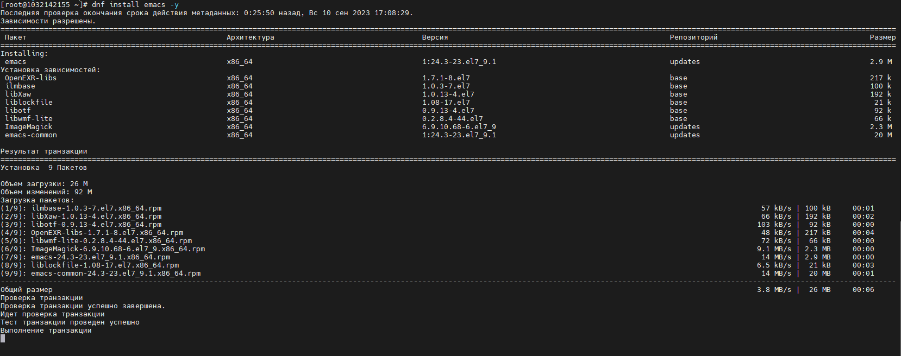
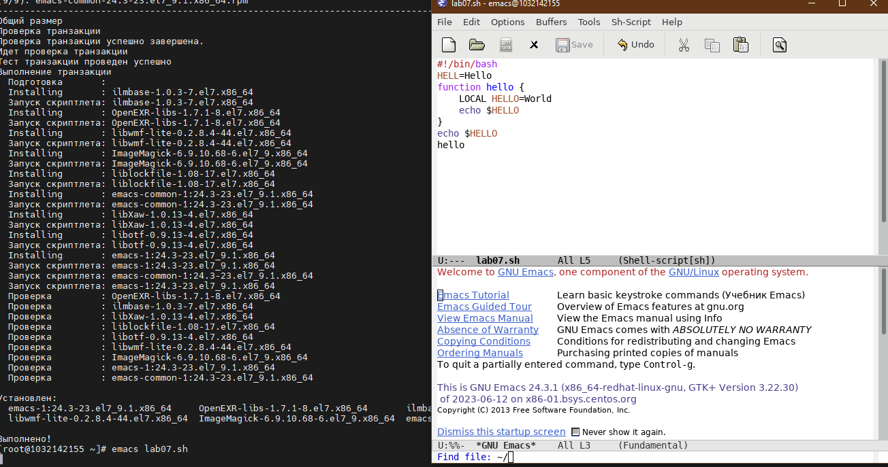
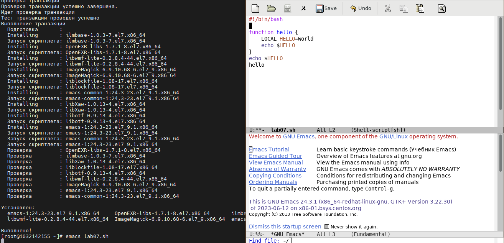
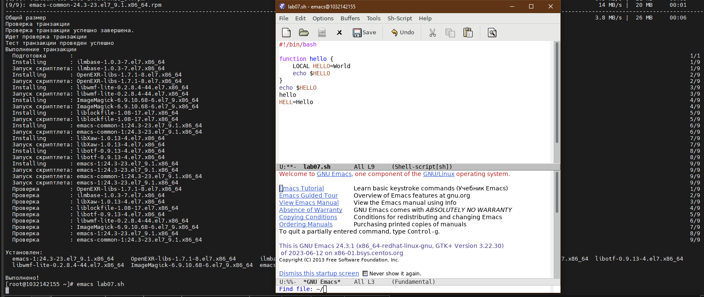
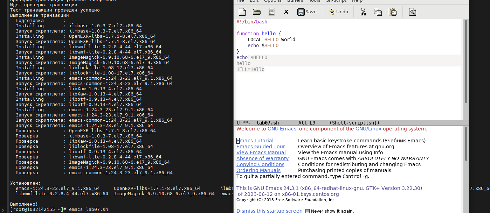
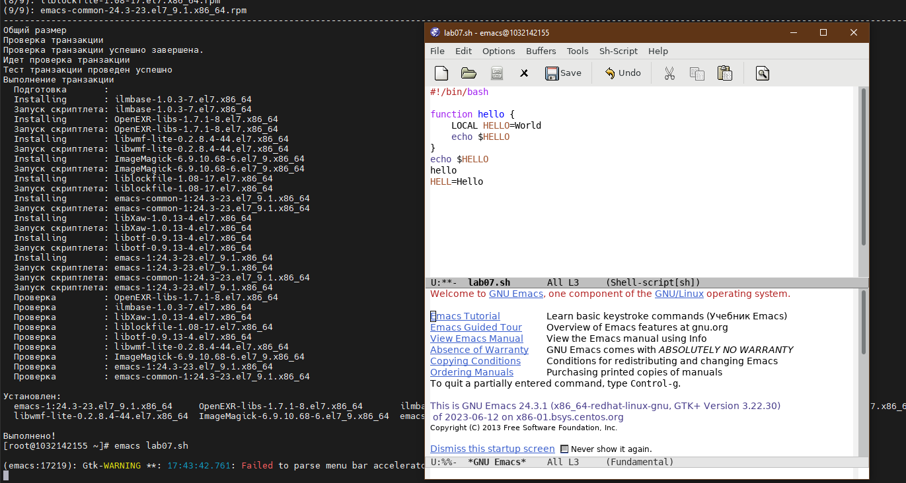
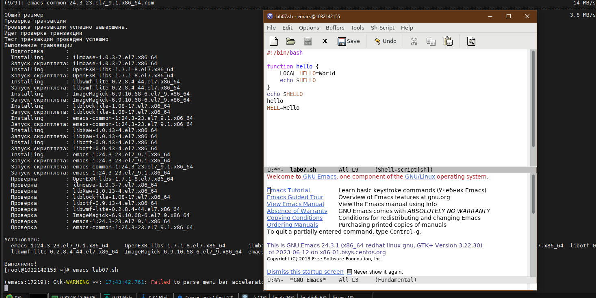
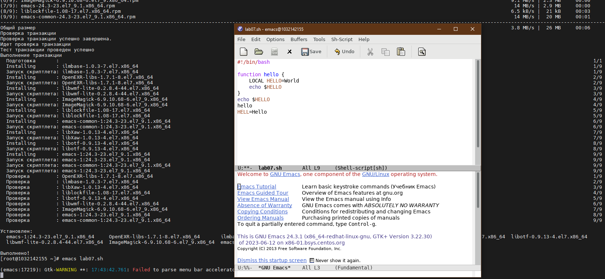

**РОССИЙСКИЙ УНИВЕРСИТЕТ ДРУЖБЫ НАРОДОВ**

**Факультет физико-математических и естественных наук**

**Кафедра прикладной информатики и теории вероятностей**

**ОТЧЕТ**

**по лабораторной работе № 10**

_дисциплина: Операционные системы_

Преподаватель: Велиева Татьяна Рефатовна

Студент: Муратов Кирилл Александрович

Группа: НПМбв-01-19

**МОСКВА**

2023 г.

**ЗАДАЧА:**

Знакомство с текстовым редактором emacs

**ЦЕЛЬ:**

Познакомиться с операционной системой Linux. Получить практические навыки работы с редактором Emacs.

**ИССЛЕДУЕМАЯ ОПЕРАЦИОННАЯ СИСТЕМА:**

1. CentOS

**ПО:**

1. Windows 10
2. Диспетчер Hyper-v от Microsoft
3. MobaXTern

**ТЕРМИНЫ:**

**SSH** (**secure shell** ) - сетевой протокол прикладного уровня, позволяющий производить удалённое управление операционной системой и туннелирование TCP-соединений.

**OS\ОС** – операционная система

**Linux** – семейство UNIX-подобных ОС на базе ядра Linux

**Начало работы**

**Вывод:**

Устанавливаю утилиту emacs командой: dnf install emacs -y

Создаю файл lab07.sh. Ввожу текст и сохраняю файл.

Вырезаю одной командой целую строку (С-k).

Вставляю эту строку в конец файла (C-y).

Выделяю область текста (C-space).

Отменяю последнее действие (С-/)

Перемещаю курсор в начало строки Ctrl+a

Перемещаю курсор в конец строки Ctrl+e

**Контрольные вопросы:**

**1. Кратко охарактеризуйте редактор emacs.**
Emacs представляет собой мощный экранный редактор текста, написанный на языке высокого уровня Elisp
**2. Какие особенности данного редактора могут сделать его сложным для освоения новичком?**
Не сандартные комбинации горячих клавиш.
**3. Своими словами опишите, что такое буфер и окно в терминологии emacsа.**
Это инструмент, который расширяет возможности текстового редактора
**4. Можно ли открыть больше 10 буферов в одном окне?**
**5. Какие буферы создаются по умолчанию при запуске emacs?**
**6. Какие клавиши вы нажмёте, чтобы ввести следующую комбинацию C-c | и C-c C-|?**
**7. Как поделить текущее окно на две части?**
**8. В каком файле хранятся настройки редактора emacs?**
**9. Какую функцию выполняет клавиша и можно ли её переназначить?**
**10. Какой редактор вам показался удобнее в работе vi или emacs? Поясните почему.**
Не один из представленных. Если нужно что-то исправить я воспользуюсь утилитой nano, или cat для просмотра содержимого. 
В целом не один редактор не отвечает моим личным пребования, к которым я привык.