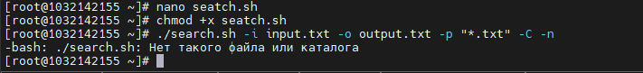
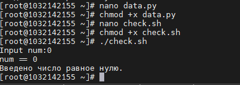
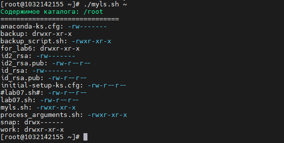
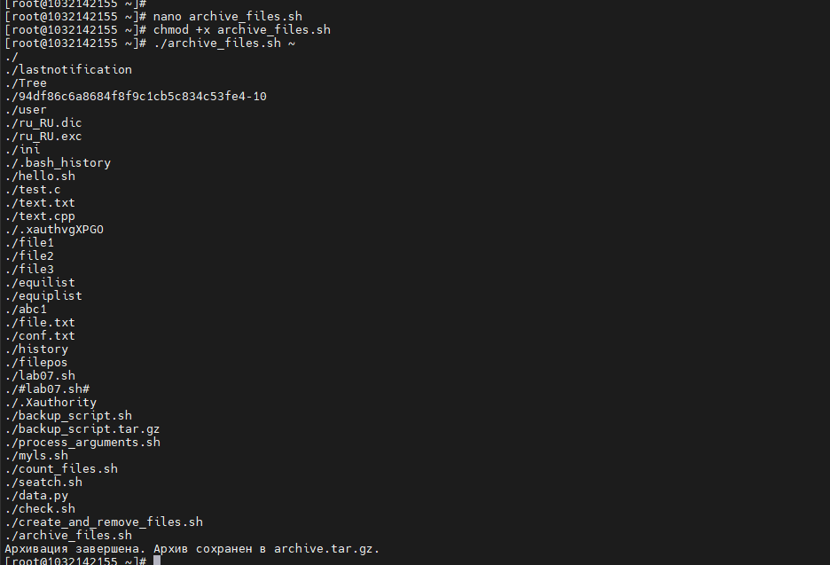

**РОССИЙСКИЙ УНИВЕРСИТЕТ ДРУЖБЫ НАРОДОВ**

**Факультет физико-математических и естественных наук**

**Кафедра прикладной информатики и теории вероятностей**

**ОТЧЕТ**

**по лабораторной работе № 11**

_дисциплина: Операционные системы_

Преподаватель: Велиева Татьяна Рефатовна

Студент: Муратов Кирилл Александрович

Группа: НПМбв-01-19

**МОСКВА**

2023 г.

**ЗАДАЧА:**

Программирование в командном процессоре ОС UNIX. Ветвления и циклы

**ЦЕЛЬ:**

Изучить основы программирования в оболочке ОС UNIX

**ИССЛЕДУЕМАЯ ОПЕРАЦИОННАЯ СИСТЕМА:**

1. CentOS

**ПО:**

1. Windows 10
2. Диспетчер Hyper-v от Microsoft
3. MobaXTern

**ТЕРМИНЫ:**

**SSH** (**secure shell** ) - сетевой протокол прикладного уровня, позволяющий производить удалённое управление операционной системой и туннелирование TCP-соединений.

**OS\ОС** – операционная система

**Linux** – семейство UNIX-подобных ОС на базе ядра Linux

**Начало работы**

Используя команды getopts grep, написать командный файл, который анализирует командную строку с ключами:
– -iinputfile — прочитать данные из указанного файла;
– -ooutputfile — вывести данные в указанный файл;
– -pшаблон — указать шаблон для поиска;
– -C — различать большие и малые буквы;
– -n — выдавать номера строк.
а затем ищет в указанном файле нужные строки, определяемые ключом -p.

Создаю командный файл командой nano search.sh, который анализирует командную строку с указанными ключами и выполняет поиск строк в файле с использованием ключа "-p":

#!/bin/bash

//Инициализация переменных для параметров
input_file=""
output_file=""
pattern=""
case_sensitive=0
line_numbers=0

//Анализ опций с использованием getopts
while getopts ":i:o:p:Chn" opt; do
case $opt in
i)
input_file="$OPTARG"
;;
o)
output_file="$OPTARG"
;;
p)
pattern="$OPTARG"
;;
C)
case_sensitive=1
;;
n)
line_numbers=1
;;
\?)
echo "Неверный параметр: -$OPTARG" >&2
exit 1
;;
:)
echo "Параметр -$OPTARG требует аргумента." >&2
exit 1
;;
esac
done

//Проверка, что был указан шаблон для поиска
if [ -z "$pattern" ]; then
echo "Ошибка: Не указан шаблон для поиска (-p)." >&2
exit 1
fi

//Проверка наличия входного файла
if [ -z "$input_file" ]; then
echo "Ошибка: Не указан входной файл (-i)." >&2
exit 1
fi

//Проверка наличия выходного файла
if [ -z "$output_file" ]; then
echo "Ошибка: Не указан выходной файл (-o)." >&2
exit 1
fi

//Флаг для grep для учета регистра (если необходимо)
grep_case_flag=""
if [ "$case_sensitive" -eq 0 ]; then
grep_case_flag="-i"
fi

//Флаг для grep для вывода номеров строк (если необходимо)
grep_line_numbers=""
if [ "$line_numbers" -eq 1 ]; then
grep_line_numbers="-n"
fi

//Выполнение поиска с использованием grep и запись результатов в выходной файл
grep $grep_case_flag $grep_line_numbers "$pattern" "$input_file" > "$output_file"

echo "Поиск завершен. Результаты сохранены в $output_file."

Сохраняю этот файл с расширением .sh search.sh. Повышаю права командой chmod +x search.sh и запускаю скрипт командой ./search.sh -i input.txt -o output.txt -p "*.txt" -C -n
Этот скрипт анализирует командную строку, выполняет поиск с использованием "grep" с учетом указанных параметров, и сохраняет результаты в выходном файле

Написать на языке Си программу, которая вводит число и определяет, является ли оно больше нуля, меньше нуля или равно нулю. Затем программа завершаетсяс помощью функции exit(n), передавая информацию в о коде завершения в оболочку. Командный файл должен вызывать эту программу и, проанализировавс помощью команды $?, выдать сообщение о том, какое число было введено.
Для выполнения этой задачи, вам нужно создать программу на языке pytnon3, которая считывает число с клавиатуры, определяет его знак и завершается с кодом завершения, соответствующим этому знаку. Затем командный файл может проверить код завершения с помощью `$?` и вывести соответствующее сообщение.
Файл с data.py

num = input("Input num:")
if(num>0):
print("num > 0")
exit(1)
elif(num < 0):
print("num < 0")
exit(-1)
else:
print("num == 0")    
exit(0)

Теперь создам командный файл check.sh,который будет вызывать эту программу и выводить сообщение в зависимости от кода завершения

#!/bin/bash

//Запускаем программу data и передаем ввод с клавиатуры
python data.py

//Проверяем код завершения
if [ $? -eq 1 ]; then
echo "Введено число больше нуля."
elif [ $? -eq -1 ]; then
echo "Введено число меньше нуля."
else
echo "Введено число равное нулю."
fi

Повышаю права двум файлам командами chmod +x data.py и chmod +x check.sh
Программа data.py вернет код завершения в командный файл, который затем будет использовать `$?` для определения знака числа и вывода соответствующего сообщения.

Написать командный файл, создающий указанное число файлов, пронумерованных последовательно от 1 до N (например 1.tmp, 2.tmp, 3.tmp,4.tmp и т.д.). Число файлов, которые необходимо создать, передаётся в аргументы командной строки. Этот же командный файл должен уметь удалять все созданные им файлы (если они существуют).
Создаю командный файл (скрипт) на bash, который будет создавать указанное количество файлов, пронумерованных последовательно от 1 до N, и также уметь удалять эти файлы.

#!/bin/bash

//Проверка наличия аргумента - количество файлов
if [ "$#" -ne 1 ]; then
echo "Использование: $0 <количество файлов>"
exit 1
fi

//Получаем количество файлов из аргумента
num_files="$1"

//Создаем файлы
for ((i = 1; i <= num_files; i++)); do
filename="${i}.tmp"
touch "$filename"
echo "Создан файл: $filename"
done

//Функция для удаления файлов
remove_files() {
for ((i = 1; i <= num_files; i++)); do
filename="${i}.tmp"
if [ -e "$filename" ]; then
rm "$filename"
echo "Удален файл: $filename"
fi
done
}

//Вешаем обработчик сигнала на удаление файлов перед выходом
trap 'remove_files' EXIT

echo "Создано $num_files файлов."

//Завершение скрипта
exit 0

Сохраняю этот скрипт в файл с расширением .sh create_and_remove_files.sh,повышаю его парва с помощью команды chmod +x create_and_remove_files.sh, и затем запустите его, указав количество файлов, которые нужно создать, в качестве аргумента командной строки.

Скрипт создаст 3 файлов с именами "1.tmp", "2.tmp", и так далее, и выведет сообщение о создании каждого файла

Написать командный файл, который с помощью команды tar запаковывает в архив все файлы в указанной директории. Модифицировать его так, чтобы запаковывались только те файлы, которые были изменены менее недели тому назад (использовать команду find).

Создаю командный файл, который архивирует все файлы в указанной директории с использованием команды tar. Затем, чтобы архивировать только те файлы, которые были изменены менее недели назад,буду использовать команду find для нахождения таких файлов и передавать их в tar.

#!/bin/bash

//Проверка наличия аргумента - директории
if [ "$#" -ne 1 ]; then
echo "Использование: $0 <директория>"
exit 1
fi

//Получаем директорию из аргумента
directory="$1"

//Проверка существования директории
if [ ! -d "$directory" ]; then
echo "Ошибка: Директория '$directory' не существует."
exit 1
fi

//Создаем временный каталог для файлов, измененных менее недели назад
tmp_dir=$(mktemp -d)

//Находим файлы, измененные менее недели назад, и копируем их во временный каталог
find "$directory" -type f -mtime -7 -exec cp {} "$tmp_dir" \;

//Создаем архив с найденными файлами
tar -czvf archive.tar.gz -C "$tmp_dir" .

//Удаляем временный каталог
rm -r "$tmp_dir"

echo "Архивация завершена. Архив сохранен в archive.tar.gz."

Сохраняю этот файл с расширением .sh archive_files.sh. Повышаю ему права chmod +x archive_files.sh и запуская ./archive_files.sh ~ указав путь к директории (домашняя директория), содержимое будет архивированно.
Этот скрипт найдет и архивирует только те файлы из указанной директории, которые были изменены менее недели назад, и сохранит архив в файле archive.tar.gz.

**Вывод**
Был получин практический опыт наисания командных файлов, работу с архивации и поиска файлов.

**Контрольные вопросы**

**1. Каково предназначение команды getopts?**
получение аргуметов из запуска bash
**2. Какое отношение метасимволы имеют к генерации имён файлов?**
**3. Какие операторы управления действиями вы знаете?**
if/elif/else
**4. Какие операторы используются для прерывания цикла?**
break
**5. Для чего нужны команды false и true?**
Логические операторы, которые отражают суть правда/ложь
**6. Что означает строка if test -f man$s/$i.$s, встреченная в командном файле?**
**7. Объясните различия между конструкциями while и until.**
Цикл while выполняет тело цикла пока условие истинно.
Цикл until выполняет тело цикла пока условие ложно