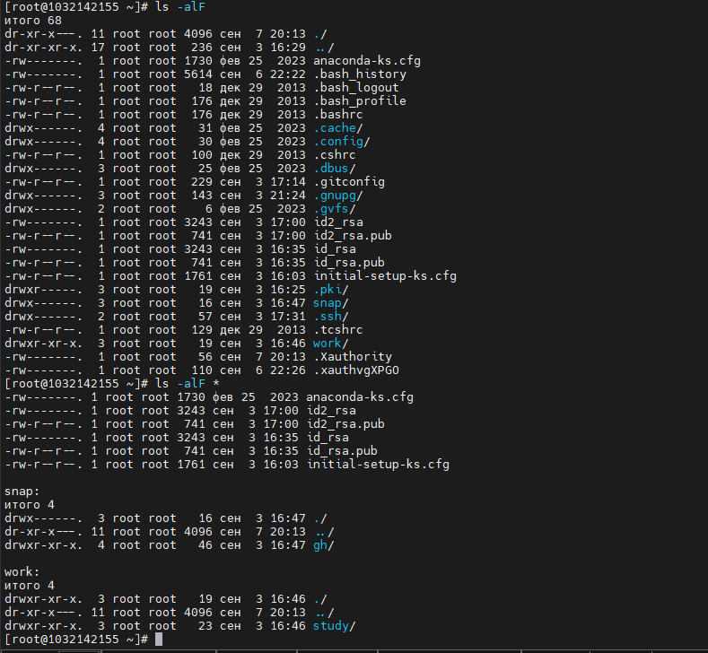
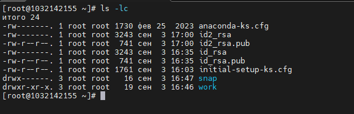

**РОССИЙСКИЙ УНИВЕРСИТЕТ ДРУЖБЫ НАРОДОВ**

**Факультет физико-математических и естественных наук**

**Кафедра прикладной информатики и теории вероятностей**

**ОТЧЕТ**

**по лабораторной работе № 5**

_дисциплина: Операционные системы_

Преподаватель: Велиева Татьяна Рефатовна

Студент: Муратов Кирилл Александрович

Группа: НПМбв-01-19

**МОСКВА**

2023 г.

**ЗАДАЧА:**

Познакомиться с основами интерфейса взаимодействия пользователя с системой Unix на уровне командной строки.

**ЦЕЛЬ:**

Приобретение практических навыков взаимодействия пользователя с системой посредством командной строки.

**ИССЛЕДУЕМАЯ ОПЕРАЦИОННАЯ СИСТЕМА:**

1. CentOS

**ПО:**

1. Windows 10
2. Диспетчер Hyper-v от Microsoft
3. MobaXTern

**ТЕРМИНЫ:**

**SSH** (**secure shell** ) - сетевой протокол прикладного уровня, позволяющий производить удалённое управление операционной системой и туннелирование TCP-соединений.

**OS\ОС** – операционная система

**VM\ВМ** – virtual machine (виртуальная машина)

**Linux** – семейство UNIX-подобных ОС на базе ядра Linux

Начало работы

С помощью команды rwd опеределяю полное имя домашнего каталога

Перехожу в директорию tmp, которая находится в корне. Команда cd /tmp/

Вывод содержимого директории tmp без аргументов. Тут представлен набор из директорий и файлов без какой-либо информации, кроме названия. Команда ls 

Вывод содержимого директории tmp с скрытыми директориями. Их цвет - зеленый, и имя начинается с "." (точки). Команда ls -a

Вывод содержимого директории tmp с информации о: правах доступа, владельца, вес, дата последний редакции и собственно название файла/директории. Команда ls -l

Вывод содержимого директории tmp с скрытыми директориями и информации о них: правах доступа, владельца, вес, дата последний редакции и собственно название файла/директории. Команда ls -al

Вывод содержимого директории tmp с скрытыми директориями, с пометкой (/ - директория, * - файл, @-) и информации о них: правах доступа, владельца, вес, дата последний редакции и собственно название файла/директории. Команда ls -alF

Директория cron - существует по адресу /var/spool. Даже есть содержимое. Команды: cd /var/spool/cron/; ls -alF

Переход в домашний каталог с помощью команды cd ~. Обзор содержимого без подкаталогов. ls -alF И просмотр подкаталогов с помошью команды ls -alF *

Создаю новую директорию командой mkdir newdir. Создаю подкаталог в каталоге newdir morefun. Проверяю, что в родительском каталоге newdir создалась директория morefun с помощью команды ls -lF вывожу информацию о ней.
Далее командой mkdir {letters,memos,misk} создаю в домашнем каталоге 3 новые директории. Вывожу их в терминал с помощью команды ls.
Далее удаляю ранее создане директории командой rmdir {letters,memos,misk}. Проверяю их отсутствие командой ls.
Далее удаляю ранее созданую деркторию mkdir и её подкаталоги командой rm -r newdir. Проверяю после удаления командой ls.

Обращаюсь к мануалу вывода содержимого каталога man ls

Для просмотра подкаталогов необходим аргумет *. Команда полностью: ls *

Сортировка по времени изменения выполняется командой: ls -lc

Команда man cd: выводит описание функции cd и её аргументов:
- l перечисляет имена содержимаво в строчку
- p отображает имена и привязки
- P отображает текущее имена и привязки
- s отображает привязанные к макросам, и строки, которые они выводят, таким образом, чтобы их можно было перечитат
- v Отображать имена и значения переменных строки чтения таким образом, чтобы их можно было перечитать
- V Отображать текущие имена и значения переменных строки чтения таким образом, чтобы их можно было перечитать

Команда man pwd: выводит описание функции pwd и её аргументов:
- L использовать PWD из среды, даже если он содержит относительные ссылки
- P игнорирование относительных путей
- help справочная информация
- version Отображает текущую версию

Команда man mkdir: выводит описание функции mkdir и её аргументов:
- m выдача прав доступа
- p родительский каталог
- help справочная информация
- version Отображает текущую версию
.

Команда man rmdir: выводит описание функции rmdir и её аргументов:
- ignore-fail-on-non-empty игнорирование пустых каталогов
- p родительский каталог
- help справочная информация
- version Отображает текущую версию
.

Команда man rm: выводит описание функции rm и её аргументов:
- f выстрое удаление. Не запрашивает разрешения на удаление
- i запросить удаление у пользователя о его намерении удалить
- d удалить пустую директорию
- help справочная информация
- version Отображает текущую версию
.

Вывожу текст на консоль командой echo. Командой !2:s/repl/hello делаю замену

**Вывод**

С помощью встроенных функций таких как: mkdir, rmdir, rm, cd, ls можно оринтироваться в файловой системе linux.

**Контрольные вопросы**

**1. Что такое командная строка?**
- Специальная оболочка, где выполняются команды
**2. При помощи какой команды можно определить абсолютный путь текущего каталога? Приведите пример.**
- pwd. result: /root
**3. При помощи какой команды и каких опций можно определить только тип файлов и их имена в текущем каталоге? Приведите примеры.**
- ls -fl. аргумет l для удобстава просмотра и дополнительной информации.
**4. Какие файлы считаются скрытыми? Как получить информацию о скрытых файлах? Приведите примеры.**
- Скрытые директории начинаются в своем именовании с "." (точки). Для получении информации о них: ls -afl
**5. При помощи каких команд можно удалить файл и каталог? Можно ли это сделать одной и той же командой? Приведите примеры.**
- rmdir <name_dir>, rm -r <name_dir>
**6. Как определить, какие команды выполнил пользователь в сеансе работы?**
- history
**7. Каким образом можно исправить и запустить на выполнение команду, которую пользователь уже использовал в сеансе работы? Приведите примеры.**
- !<num_of_cmd>:s/<old_value>/<new_value>
**8. Можно ли в одной строке записать несколько команд? Если да, то как? Приведите примеры.**
- Да, можно. Нужно использовать ";" (точка с зарятой). mkdir newdir; ls; rmdir newdir
**9. Что такое символ экранирования? Приведите примеры использования этого символа.**
- Экранирование "\" нужно чтобы не ломался синтаксис команды. echo \\text result: \text
**10. Какая информация выводится на экран о файлах и каталогах, если используется опция l в команде ls?**
- Будут выведены файлы и директории и информация о них: права доступа, владельца, объем, дата последний редакции и название
**11. Что такое относительный путь к файлу? Приведите примеры использования относительного и абсолютного пути при выполнении какой-либо команды.**
**12. Как получить информацию об интересующей вас команде?**
- ls -alf /<dir_name>
**13. Какая клавиша или комбинация клавиш служит для автоматического дополнения вводимых команд?**
- клавиша tab. Стрелки вверх и вниз выводят содержимое history