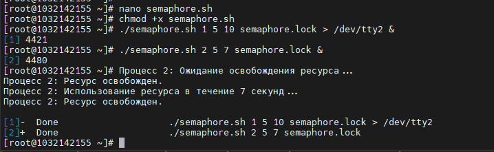

**РОССИЙСКИЙ УНИВЕРСИТЕТ ДРУЖБЫ НАРОДОВ**

**Факультет физико-математических и естественных наук**

**Кафедра прикладной информатики и теории вероятностей**

**ОТЧЕТ**

**по лабораторной работе № 11**

_дисциплина: Операционные системы_

Преподаватель: Велиева Татьяна Рефатовна

Студент: Муратов Кирилл Александрович

Группа: НПМбв-01-19

**МОСКВА**

2023 г.

**ЗАДАЧА:**

Программирование в командном процессоре ОС UNIX. Ветвления и циклы

**ЦЕЛЬ:**

Изучить основы программирования в оболочке ОС UNIX

**ИССЛЕДУЕМАЯ ОПЕРАЦИОННАЯ СИСТЕМА:**

1. CentOS

**ПО:**

1. Windows 10
2. Диспетчер Hyper-v от Microsoft
3. MobaXTern

**ТЕРМИНЫ:**

**SSH** (**secure shell** ) - сетевой протокол прикладного уровня, позволяющий производить удалённое управление операционной системой и туннелирование TCP-соединений.

**OS\ОС** – операционная система

**Linux** – семейство UNIX-подобных ОС на базе ядра Linux

**Начало работы**

Написать скрипт, который при запуске будет делать резервную копию самого себя (то есть файла, в котором содержится его исходный код) в другую директорию backup в вашем домашнем каталоге. При этом файл должен архивироваться одним из архиваторов на выбор zip, bzip2 или tar.
Для создания скрипта, который делает резервную копию самого себя в другую директорию и архивирует его,буду использовать следующий bash-скрипт:

#!/bin/bash

//Путь к текущему скрипту
script_path="$(readlink -f "$0")"

//Имя скрипта без пути
script_name="$(basename "$script_path")"

//Директория для резервных копий
backup_dir="$HOME/backup"

//Проверяем, существует ли директория backup, и создаем ее, если нет
if [ ! -d "$backup_dir" ]; then
mkdir -p "$backup_dir"

//Файл для резервной копии (архив)
backup_file="$backup_dir/${script_name%.*}.tar.gz"

//Создаем архив
tar -czvf "$backup_file" "$script_path"

//Выводим сообщение об успешном создании резервной копии
echo "Резервная копия скрипта $script_name создана в $backup_file"

Сохраняю этот скрипт в файл с расширением .sh backup_script.sh, повышаю его права chmod +x backup_script.sh, и затем запускаю его. Он создаст резервную копию самого себя в директории "backup" в домашнем каталоге в формате tar.gz. Чтобы изменить формат архива, необходимо указать другую опцию для команды tar, например, tar -cjvf для bzip2 или tar -czvf для zip.

Написать пример командного файла, обрабатывающего любое произвольное число аргументов командной строки, в том числе превышающее десять. Например, скрипт может последовательно распечатывать значения всех переданных аргументов
Для обработки произвольного числа аргументов командной строки в командном файле (скрипте) можно использовать цикл, который перебирает все переданные аргументы. "process_arguments.sh"  печатает все переданные аргументы:

#!/bin/bash

//Перебираем все аргументы командной строки
for arg in "$@"; do
echo "Аргумент: $arg"

Сохраняю этот скрипт с расширением .sh process_arguments.sh, повышаю его права chmod +x process_arguments.sh, и затем запускаю его комадой ./process_arguments.sh arg1 arg2 arg3 arg4 arg5 arg6 arg7 arg8 arg9 arg10 arg11. Скрипт выведет все переданные аргументы на экран, независимо от их количества

Написать командный файл — аналог команды ls (без использования самой этой команды и команды dir). Требуется, чтобы он выдавал информацию о нужном каталоге и выводил информацию о возможностях доступа к файлам этого каталога

"$@" в скрипте представляет собой специальную переменную, которая хранит все аргументы командной строки, переданные скрипту.

Для создания командного файла, который аналогичен команде `ls` и выводит информацию о каталоге и правах доступа к файлам, вы можете использовать следующий bash-скрипт:

#!/bin/bash

//Проверка наличия аргумента - путь к каталогу. Если аргумент не передан, используется текущий каталог.
directory="${1:-.}"

//Проверка существования каталога
if [ ! -d "$directory" ]; then
echo "Ошибка: Каталог '$directory' не существует."
exit 1
fi

//Вывод информации о каталоге
echo "Содержимое каталога: $directory"
echo "=============================="

//Перебор файлов и директорий в каталоге
for entry in "$directory"/*; do
//Получение имени файла/директории без пути
entry_name=$(basename "$entry")

//Получение прав доступа к файлу/директории
permissions=$(stat -c "%A" "$entry")

//Вывод имени и прав доступа
echo "$entry_name: $permissions"

exit 0

Сохраняю этот скрипт в файл с расширением .sh myls.sh, повышаю его права chmod +x myls.sh, и затем запускаю его командой ./myls.sh /путь/к/каталогу

Скрипт выведет список файлов и директорий в указанном каталоге, а также их права доступа.

Написать командный файл, который получает в качестве аргумента командной строки формат файла (.txt, .doc, .jpg, .pdf и т.д.) и вычисляет количество таких файлов в указанной директории. Путь к директории также передаётся в виде аргумента командной строки.

#!/bin/bash

//Проверка количества аргументов
if [ "$#" -ne 2 ]; then
echo "Использование: $0 <формат файла> <директория>"
exit 1
fi

//Получение формата файла и пути к директории из аргументов
file_format="$1"
directory="$2"

//Проверка существования директории
if [ ! -d "$directory" ]; then
echo "Ошибка: Директория '$directory' не существует."
exit 1
fi

//Подсчет файлов с заданным форматом в директории
file_count=$(find "$directory" -type f -name "*.$file_format" | wc -l)

//Вывод результата
echo "Количество файлов с расширением .$file_format в директории '$directory': $file_count"

Сохраняю этот скрипт в файл с расширением .sh count_files.sh, повышаю его права chmod +x backup_script.sh, и затем запускаю его командой ./count_files.sh txt /путь/к/директории

Скрипт выведет количество файлов с указанным форматом в указанной директории.

**Вывод:**

Получил практические навыки написания скиптов. Обратобку аргеметов и работу с условными операторами и циклами.

**Контрольные вопросы:**

**1. Объясните понятие командной оболочки. Приведите примеры командных оболочек. Чем они отличаются?**
Это программа, которая позволяет взаимодействовать с операционной системой через терминал и в командной строке. Bash — самая распространённая оболочка под Linux. Синтаксисом.
**2. Что такое POSIX?**
набор стандартов описания интерфейсов взаимодействия операционной системы и прикладных программ.
**3. Как определяются переменные и массивы в языке программирования bash?**
var = "value" - это определение переменной; array = (one two three four [5]=five) - это массив.
**4. Каково назначение операторов let и read?**
Команда let берет два операнда и присваивает их переменной.
Команда read позволяет читать значения переменных.
**5. Какие арифметические операции можно применять в языке программирования bash?**
let A=5+4
echo $A # 9

let A=5-4
echo $A # 1

let A=5*4
echo $A # 20

let A=5/5
echo $A # 1

let A=5%5
echo $A # 1

инкременировать и декрементировать.
**6. Что означает операция (( ))?**
в математическом пространстве это матрица.
**7. Какие стандартные имена переменных Вам известны?**
$BASH

В переменной $BASH содержится полный путь до исполняемого файла командной оболочки Bash.

$BASH_VERSION

В переменную $BASH_VERSION записывается версия Bash.

$CDPATH

Переменная, которая хранит пути поиска каталога. (используется при вводе команды cd имя_каталога без слэша)

$CLASSPATH

содержит список каталогов для поиска файлов классов Java и архивов Java.

$HOME

домашний каталог текущего пользователя.

$HOSTNAME

В переменной $HOSTNAME хранится имя компьютера.

$HISTSIZE

количество событий, хранимых в истории за 1 сеанс

$HISTFILE

Расположение файла истории событий

$HISTFILESIZE

количество событий, хранимых в истории между сеансами

$IFS

переменная хранит символы, являющиеся разделителями команд и параметров. (по умолчанию - пробел, табуляция и новая строка)

$LANG

текущая установка локализации, которая позволяет настроить командную оболочку для использования в различных странах и на различных языках.

$MAIL

Место, где храниться почта

$OSTYPE

В переменной $OSTYPE содержится описание операционной системы.

$PATH

список каталогов для поиска команд и приложений, когда полный путь к файлу не задан.

$PS1

PS1 используется как основная строка приглашения. (то самое [root@proxy ~]#)

$PS2

PS2 используется как вторичная строка приглашения.

$PROMPT_COMMAND

Эта команда должна быть выполнена до отображения строки приглашения Bash.

$PWD

полный путь к текущему рабочему каталогу.

$SHELL

полный путь к текущей командной оболочке.

$USER

В переменной $USER содержится имя текущего пользователя.

**8. Что такое метасимволы?**
работать с файлами и эффективно перенаправлять их ввод и вывод. Для этого можно использовать специальные символы — метасимволы. Они придают командам оболочки особое значение, открывая вам выигрышные комбинации Linux

**9. Как экранировать метасимволы?**
# - коментарий

**10. Как создавать и запускать командные файлы?**
В начале файла написать #!/bin/bash
Далее написать какую-ту логику. Сохранить. Выдать права на выполнение и написать в терминал ./название_файла.sh
**11. Как определяются функции в языке программирования bash?**
ключевым словом function название_функции

**12. Каким образом можно выяснить, является файл каталогом или обычным файлом?**
с помощью фильтрации

**13. Каково назначение команд set, typeset и unset?**
set - установить новое значение переменной
typeset - 
unset - удалить переменную. 
**14. Как передаются параметры в командные файлы?**
./название_файла.sh arg1 arg2 
**15. Назовите специальные переменные языка bash и их назначение.**
$* — отображается вся командная строка или параметры оболочки;
$? — код завершения последней выполненной команды;
$$ — уникальный идентификатор процесса, в рамках которого выполняется командный процессор;
$! — номер процесса, в рамках которого выполняется последняя вызванная на выполнение в командном режиме команда;
$- — значение флагов командного процессора;
${#*} — возвращает целое число — количество слов, которые были результатом $*;
${#name} — возвращает целое значение длины строки в переменной name;
${name[n]} — обращение к n-му элементу массива;
${name[*]} — перечисляет все элементы массива, разделённые пробелом;
${name[@]} — то же самое, но позволяет учитывать символы пробелы в самих переменных;
${name:-value} — если значение переменной name не определено, то оно будет заменено на указанное value;
${name:value} — проверяется факт существования переменной;
${name=value} — если name не определено, то ему присваивается значение value;
${name?value} — останавливает выполнение, если имя переменной не определено, и выводит value как сообщение об ошибке;
${name+value} — это выражение работает противоположно ${name-value}. Если переменная определена, то подставляется value;
${name#pattern} — представляет значение переменной name с удалённым самым коротким левым образцом (pattern);
${#name[*]} и ${#name[@]} — эти выражения возвращают количество элементов в массиве name.
