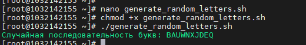

**РОССИЙСКИЙ УНИВЕРСИТЕТ ДРУЖБЫ НАРОДОВ**

**Факультет физико-математических и естественных наук**

**Кафедра прикладной информатики и теории вероятностей**

**ОТЧЕТ**

**по лабораторной работе № 13**

_дисциплина: Операционные системы_

Преподаватель: Велиева Татьяна Рефатовна

Студент: Муратов Кирилл Александрович

Группа: НПМбв-01-19

**МОСКВА**

2023 г.

**ЗАДАЧА:**

Программирование в командном процессоре ОС UNIX. Расширенное программирование

**ЦЕЛЬ:**

Изучить основы программирования в оболочке ОС UNIX

**ИССЛЕДУЕМАЯ ОПЕРАЦИОННАЯ СИСТЕМА:**

1. CentOS

**ПО:**

1. Windows 10
2. Диспетчер Hyper-v от Microsoft
3. MobaXTern

**ТЕРМИНЫ:**

**SSH** (**secure shell** ) - сетевой протокол прикладного уровня, позволяющий производить удалённое управление операционной системой и туннелирование TCP-соединений.

**OS\ОС** – операционная система

**Linux** – семейство UNIX-подобных ОС на базе ядра Linux

**Начало работы**

Написать командный файл, реализующий упрощённый механизм семафоров. Командный файл должен в течение некоторого времени t1 дожидаться освобождения ресурса, выдавая об этом сообщение, а дождавшись его освобождения, использовать его в течение некоторого времени t2<>t1, также выдавая информацию о том, что ресурс используется соответствующим командным файлом (процессом). Запустить командный файл в одном виртуальном терминале в фоновом режиме, перенаправив его вывод в другой (> /dev/tty#, где # — номер терминала куда перенаправляется вывод), в котором также запущен этот файл, но не фоновом, а в привилегированном режиме. Доработать программу так, чтобы имелась возможность взаимодействия трёх и более процессов

Для создания упрощенного механизма семафоров в командном файле на bash, который позволит дожидаться освобождения ресурса и использовать его, нужно использовать механизм блокировки с помощью файла.

#!/bin/bash

//Проверка наличия аргументов
if [ "$#" -ne 4 ]; then
echo "Использование: $0 <номер_терминала> <время_ожидания> <время_использования> <файл_семафора>"
exit 1
fi

terminal_number="$1"
wait_time="$2"
use_time="$3"
semaphore_file="$4"

//Функция для блокировки семафора
lock_semaphore() {
echo "Процесс $terminal_number: Ожидание освобождения ресурса..."
while ! ln -s $$ "$semaphore_file" 2>/dev/null; do
sleep 1
done
echo "Процесс $terminal_number: Ресурс освобожден."
}

//Функция для освобождения семафора
unlock_semaphore() {
rm -f "$semaphore_file"
echo "Процесс $terminal_number: Ресурс освобожден."
}

//Ожидание освобождения ресурса
lock_semaphore

//Использование ресурса
echo "Процесс $terminal_number: Использование ресурса в течение $use_time секунд..."
sleep "$use_time"

//Освобождение ресурса
unlock_semaphore

exit 0

Этот командный файл принимает следующие аргументы:
1. Номер терминала.
2. Время ожидания (t1) - время, в течение которого процесс будет ожидать освобождения ресурса.
3. Время использования (t2) - время, в течение которого процесс будет использовать ресурс.
4. Файл семафора - файл, используемый для блокировки ресурса.

Первый процесс будет ожидать освобождения ресурса в течение 5 секунд, затем использовать его в течение 10 секунд и выводить информацию о действиях во второй терминал. 
Второй процесс будет использовать ресурс в течение 7 секунд и также выводить информацию о действиях. 

Реализовать команду man с помощью командного файла. Изучите содержимое каталога /usr/share/man/man1. В нем находятся архивы текстовых файлов, содержащих справку по большинству установленных в системе программ и команд. Каждый архив можно открыть командой less сразу же просмотрев содержимое справки. Командный файл должен получать в виде аргумента командной строки название команды и в виде результата выдавать справку об этой команде или сообщение об отсутствии справки, если соответствующего файла нет в каталоге man1.
Для создания командного файла, который будет эмулировать команду man. Нужно будет проверить наличие файла справки в каталоге /usr/share/man/man1 и,
если файл существует, вывести его содержимое с помощью команды less.

#!/bin/bash

//Проверка наличия аргумента - названия команды
if [ "$#" -ne 1 ]; then
echo "Использование: $0 <название_команды>"
exit 1
fi

command_name="$1"
man_directory="/usr/share/man/man1"

//Проверка существования файла справки
man_file="$man_directory/$command_name.1"
if [ -e "$man_file" ]; then
//Вывод справки с использованием less
less "$man_file"
else
echo "Справка для команды '$command_name' не найдена."
fi

exit 0

Скрипт будет проверять наличие файла справки для указанной команды в каталоге /usr/share/man/man1 и, если файл существует, выводить его содержимое с помощью less. В противном случае, он выдаст сообщение о том, что справка не найдена.

Используя встроенную переменную $RANDOM, напишите командный файл, генерирующий случайную последовательность букв латинского алфавита. Учтите, что $RANDOM выдаёт псевдослучайные числа в диапазоне от 0 до 32767
Создаю командный файл на bash, который будет генерировать случайную последовательность букв латинского алфавита, используя встроенную переменную $RANDOM.

#!/bin/bash

//Функция для генерации случайной буквы латинского алфавита
random_letter() {
local letters=("A" "B" "C" "D" "E" "F" "G" "H" "I" "J" "K" "L" "M" "N" "O" "P" "Q" "R" "S" "T" "U" "V" "W" "X" "Y" "Z")
local random_index=$((RANDOM % 26))
echo "${letters[random_index]}"
}

//Генерация случайной последовательности букв
random_string=""
length=10  # Задайте желаемую длину строки

for ((i = 0; i < length; i++)); do
random_string="${random_string}$(random_letter)"
done

echo "Случайная последовательность букв: $random_string"

Этот скрипт создает случайную строку букв латинского алфавита заданной длины (в данном случае, 10 букв).
Можно изменить значение переменной length, чтобы получить строку другой длины.

**Вывод**
Был получин практический опыт написания инструкций с использованием встроенных команд.

**Контрольные вопросы**

**1. Найдите синтаксическую ошибку в следующей строке:while [$1 != "exit"]**
Отсутствие тела цикла
**2. Как объединить (конкатенация) несколько строк в одну?**
С помощью переменных. Переменные должны быть объявлены. var1 = "new" var2 = " text" echo "$var1 $var2"
**3. Найдите информацию об утилите seq. Какими иными способами можно реализовать её функционал при программировании на bash?**
**4. Какой результат даст вычисление выражения $((10/3))?**
результат будет равен 3
**5. Укажите кратко основные отличия командной оболочки zsh от bash.**
**6. Проверьте, верен ли синтаксис данной конструкции for ((a=1; a <= LIMIT; a++))**
Требуется выполнить 2 условия, чтобы цикл начал работать. 1. LIMIN дожен быть >=1 2 должно быть тело цикла.
**7. Сравните язык bash с какими-либо языками программирования. Какие преимущества у bash по сравнению с ними? Какие недостатки?**
bash - некомпилируемый файл. Его выполняет среда. Подходит для локальных задач. Маленький функционал
c# - компилируемый язык. Выполняется на виртуальной машине .net. Любая задача от консоли до сервера. Огромный багаж инструментов под разные задачи.