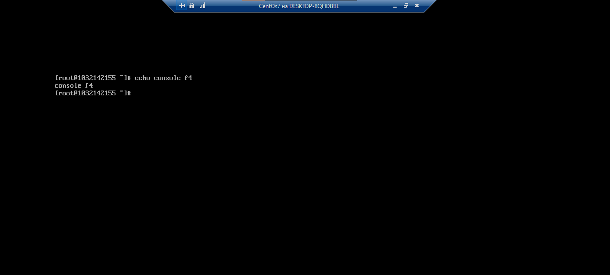

**РОССИЙСКИЙ УНИВЕРСИТЕТ ДРУЖБЫ НАРОДОВ**

**Факультет физико-математических и естественных наук**

**Кафедра прикладной информатики и теории вероятностей**

**ОТЧЕТ**

**по лабораторной работе № 4**

_дисциплина: Операционные системы_

Преподаватель: Велиева Татьяна Рефатовна

Студент: Муратов Кирилл Александрович

Группа: НПМбв-01-19

**МОСКВА**

2023 г.

**ЗАДАЧА:**

Познакомиться с операционной системой Linux, получить практические навыки работы с консолью и некоторыми графическими менеджерами рабочих столов операционной системы.

**ЦЕЛЬ:**

Получение практических навыков.

**ИССЛЕДУЕМАЯ ОПЕРАЦИОННАЯ СИСТЕМА:**

1. CentOS

**ПО:**

1. Windows 10
2. Диспетчер Hyper-v от Microsoft
3. MobaXTern

**ТЕРМИНЫ:**

**SSH** (**secure shell** ) - сетевой протокол прикладного уровня, позволяющий производить удалённое управление операционной системой и туннелирование TCP-соединений.

**OS\ОС** – операционная система

**VM\ВМ** – virtual machine (виртуальная машина)

**Linux** – семейство UNIX-подобных ОС на базе ядра Linux
**GUI** - graphical user interface (пользовательский графический интерфейс)

Начало работы

**Определение 1.** Компьютерный терминал — устройство ввода–вывода, основные функции которого заключаются в вводе и отображении данных.
**Определение 2.** Текстовый терминал (терминал, текстовая консоль) — интерфейс компьютера для последовательной передачи данных.
**Определение 3.** Учётная запись пользователя (user account) — идентификатор пользователя, на основе которого ему назначаются права на действия в операционной системе.
**Определение 4.** Входное имя пользователя (Login) — название учётной записи пользователя.
**Определение 5.** Виртуальные консоли — реализация концепции многотерминальной работы в рамках одного устройства.
**Определение 6.** Весь процесс взаимодействия пользователя с системой с момента регистрации до выхода называется сеансом работы.
Загрузка и авторизация в системе.

Рабочий стол после авторизации и аутентификации. Стартовое положение "текстового" терминала

Для переключения между тестовыми терминалами нужно использовать "горячие" сочение клавиш: **Ctrl** + **Alt** + **F**n, где n это номер функциональной клавиши.
На данном примере была 2 => **Ctrl** + **Alt** + **F2**
Для того чтобы вернуться в GUI нужно использовать "горячие" сочение клавиш: **Ctrl** + **Alt** + **F1**

Логирование в текстовой консоли. Вводится имя учётной записи. Далее нужно нажать **Enter**. Вводим пароль, но он не отображается (всё в порядке. Так и задуманно).

После удачного входа - будет отображается имя пользователя, который вводил свои данные.

Для демонстрации количесва рабочих текстовых терминалов буду вывод текст на консоль.

По умолчанию менеджером рабочего стола и Cent OS rpm

Просмотр программ из "коробки"

**Вывод**

Было проведено знакомство с базовыми терминами и минимальном функционалом операционной сисемы Cent OS. Был краткий обзор на ПО, которое предоставляется из "коробки"

**Контрольные вопросы**

**1. Что такое компьютерный терминал? Есть ли, по вашему мнению, у него преимущества перед графическим интерфейсом?**
-Терминал - это то место (ПО), которое принимает команды для выполнения на прямую. Преимущества: не обходимости в дополнительных ресурсах, так-как нет графической оболочки, да не все команды реализованы в графическом исполнении.
**2. Что такое входное имя пользователя?**
-Логин пользователя. Нужен для входа в систему, получения прав и состава групп. Читабелен для человека в отличие от уникального номера, который может быть предствлен не только в 10ной сис. исчисления.
**3. В каком файле хранятся пароли пользователей? В каком виде они хранятся?**
-Место хранения /etc/shadow.Ввиде хеша.
**4. Где хранятся настройки пользовательских программ?**
-В домашнем каталоге пользователя.
**5. Какое входное имя у администратора ОС Unix?**
-root
**6. Имеет ли администратор доступ к настройкам пользователей?**
-root может совершать любые действия. Ограничения отсутствуют.
**7. Каковы основные характеристики многопользовательской модели разграничения доступа?**
-Чтение, изменение, запуск файлов, а также на ресурсы: пространство на файловой системе, процессорное время для выполнение текущих задач (процессов). При этом действия одного пользователя не влияют на работу другого.
**8. Какую информацию кроме пароля и логина содержит учётная запись пользователя?**
-UID,GID,GECOS,дом.кат.,shell
**9. Что такое UID и GID? Расшифруйте эти аббревиатуры.**
-UID (уникальный индификатор пользователя) - положительное целое число в диапазоне от 0 до 65535 (2^16), по которому в системе однозначно отслеживаются действия пользователя.
-GID (уникальный индификатор группы) - положительное целое число в диапазоне от 0 до 65535 (2^16), по которому в системе однозначно отслеживаются действия группы.
**10. Что такое GECOS?**
-GECOS (анкета пользователя) являются необязательным параметром учётной записи и могут содержать реальное имя пользователя (фамилию, имя), адрес, телефон.
**11. Что такое домашний каталог? Какие файлы хранятся в нем?**
- Пространство пользователя. реализиция многопользовательского режима. Содержимое: Видео, Загрзки, Музыка, Рабочий стол, Документы, Изображения, Общедоступные, Шаблоны
**12. Как называется ваш домашний каталог?**
- /home/1032142155
**13. Имеет ли администратор возможность изменить содержимое домашнего каталога пользователя?**
-root может делать любые действия
**14. Что хранится в файле /etc/passwd?**
-информация о пользователях и их информации.
**15. Как, просмотрев содержимое файла /etc/passwd, узнать, какие пользователи не смогут войти в систему?**
- повысить права su -. ввести пароль. и ввести cat
**16. Что такое виртуальные консоли? Как вы думаете, что означает слово «виртуальный» в данном контексте?**
- Виртуальная консоль - это изолированная консоль. Не влияет на работу других консолей. 
**17. Зачем нужна программа getty?**
- Медиа проигрователь
**18. Что такое сеанс работы?**
- Весь процесс взаимодействия пользователя с системой с момента регистрации до выхода называется сеансом работы.
**19. Что такое тулкит?**
- Toolkit (Tk, «набор инструментов», «инструментарий»)— кроссплатформенная библиотека базовых элементов графического интерфейса, распространяемаяс открытыми исходными текстами.
**20. Какие основные тулкиты существуют в системе Unix?**
- Используются следующие основные тулкиты:
  – GTK+ (сокращение от GIMP Toolkit) — кроссплатформенная библиотека элементовинтерфейса;
  – Qt — кросс-платформенный инструментарий разработки программного обеспеченияна языке программирования C++.
  GTK+ состоит из двух компонентов:
  – GTK — содержит набор элементов пользовательского интерфейса (таких, как кнопка,список, поле для ввода текста и т. п.) для различных задач;
  – GDK — отвечает за вывод информации на экран, может использовать для этогоX Window System, Linux Framebuffer, WinAPI.
  На основе GTK+ построены рабочие окружения GNOME, LXDE и Xfce. Естественно, эти тулкиты могут использоваться и за пределами «родных» десктопных окружений. Qt используется в среде KDE (Kool Desktop Environment).